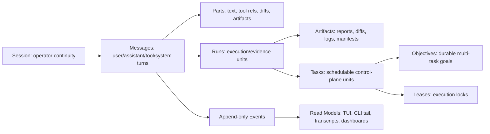
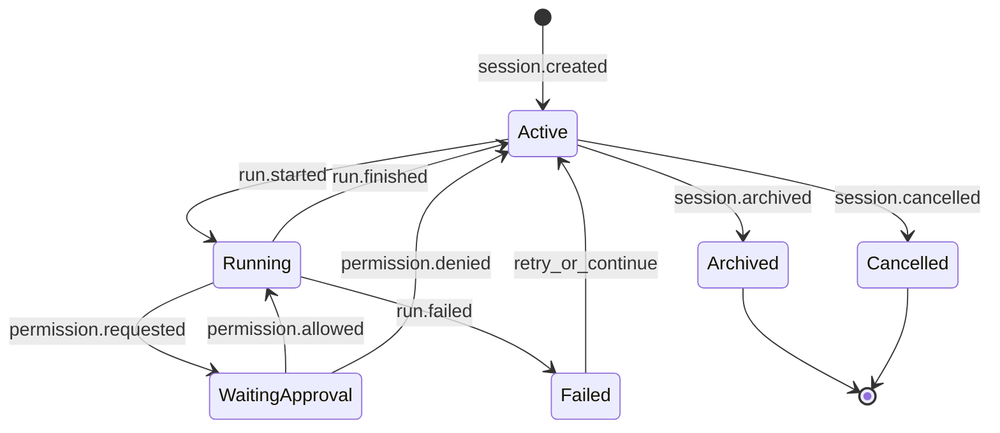

# OpenCode Experience Gap Plan

## Summary

Bring Harness closer to the OpenCode experience while preserving the core Harness structure we already have: Python/Typer CLI, Textual TUI, local SQLite control plane, explicit objectives/tasks/leases, registered adapters, evidence artifacts, safety policies, runtime controls, and approval boundaries.

This is not a rewrite into OpenCode's TypeScript client/server stack. The target is product parity where it matters to the operator:

- a session-first coding loop instead of a command-catalog-first control plane;
- fast model/provider/agent switching;
- interactive permissions and resumable sessions;
- a rich terminal UI with live events, diffs, todos, files, terminals, and approvals in one place;
- a headless local server API for web/desktop/remote clients;
- pluggable tools, MCP, LSP, and skills without bypassing Harness policy.

Upstream reference checked: `anomalyco/opencode` `dev` at commit `c5db39f6268a36194a7fe5f833ae3197dfe250b6` from 2026-05-16.

## Keep

Do not discard these Harness foundations:

- durable project state under `.harness/`;
- declarative built-in specs, workbenches, agents, model profiles, memory scopes, and tool policies;
- durable objectives, tasks, leases, runs, artifacts, progress, baselines, evals, integrity checks, and traces;
- registered execution adapters instead of arbitrary execution;
- hosted-boundary approvals separate from active-repo apply-back;
- runtime controls, adapter breakers, blocked-state explanations, secret/path guards, and evidence manifests;
- existing Codex direct foreground run and isolated edit adapters;
- existing self-managed local action spine.

The plan below adds OpenCode-like surfaces around this structure rather than flattening the safety model.

## Release-Blocking Invariants

These are not implementation preferences. They are release gates for the OpenCode-like work:

- **Persist before display:** no TUI update, CLI live line, permission prompt, tool call, model output, diff, test output, terminal output, or run status may be emitted only in memory. Every user-visible update must be backed by an append-only persisted event or an immutable persisted message/part.
- **Events are append-only:** event records are never updated in place. Corrections, retractions, redactions, summary replacements, retries, and reversions are represented as new events.
- **Messages are mostly immutable:** historical message records and message parts are not rewritten except for narrowly defined metadata repairs. User-visible corrections must use explicit correction/retraction events.
- **Mutable state is projection state:** session title, summary, status, archived flag, token totals, UI preferences, and cached dashboard fields may change, but they must be derivable from or explainable by persisted records/events.
- **Sessions do not grant authority:** sessions are continuity and evidence containers. Tool permissions, hosted-boundary approvals, apply-back, shell/network/MCP/PTY, and active-repo mutation still go through Harness policy, leases, adapters, approvals, runtime controls, and manifests.
- **No hidden provider fallback:** if a selected provider/model/backend cannot run, execution fails visibly or asks for an explicit operator choice. Harness must never silently substitute another provider, model, billing boundary, hosted route, or fallback backend.
- **Server-shaped APIs from the start:** Phase 1 and Phase 2 may run in-process through CLI/TUI, but store/event/service APIs must be written as if a later `harness serve` API and SSE/WebSocket stream will consume the same contracts.

## Canonical Relationship Model

Use one relationship model throughout implementation:

```text
Session
  -> Messages
  -> Parts
  -> Events
  -> linked Runs
  -> linked Tasks / Objectives / Artifacts
```

Rules:

- A session is the operator-facing continuity layer.
- A message is one user, assistant, tool, or system turn inside a session.
- A message may spawn zero or more runs.
- A run is one execution/evidence unit.
- A run may produce zero or more artifacts.
- A task is the schedulable control-plane unit.
- A task may belong to an objective.
- A task may be linked back to the session/message that requested it.
- An artifact is immutable evidence or a generated projection with manifest metadata.
- Memory, approvals, baselines, traces, and runtime controls may be referenced by events, but references do not grant authority.



State model:



## OpenCode Capabilities We Are Missing Or Only Partly Cover

### 1. Session-First Product Spine

OpenCode centers everything on sessions: create, list, continue, fork, archive/delete, share, summarize, export/import, abort, prompt async, message history, message diff, message deletion, part update, revert/unrevert, status, and children.

Harness currently has runs, objectives, tasks, and chat state, but not a first-class session entity that owns an ongoing coding conversation across runs.

Missing:

- persistent chat sessions independent of a single run;
- continue last session and continue by session id;
- fork a session at a message;
- session titles, summaries, token/cost rollups, and archival;
- session-level todos, diffs, and message history;
- session export/import with sanitization;
- session abort tied to live execution;
- shareable session snapshots, even if initially local-only.

### 2. Rich TUI Workflow

OpenCode's terminal/web app has session timeline, composer, request tree, todo dock, permission dock, question dock, revert dock, follow-up dock, file tabs, side panel, terminal panel, command palette, model/theme/settings dialogs, keyboard shortcuts, and multi-language UI strings.

Harness has a Textual dashboard/chat/palette, but the experience is still mostly a control-plane browser plus a prompt.

Missing:

- session timeline as the primary screen;
- live assistant/tool/test/diff stream in the transcript;
- composer with attachments, slash commands, agent/model selector, and prompt history;
- visible permission queue and question queue;
- todo dock tied to the active session;
- revert/apply-back dock tied to changed files;
- file/diff tabs and changed-file navigation;
- integrated terminal/PTY panel;
- command palette that executes safe UI actions, not only shows copyable commands;
- configurable keyboard shortcuts;
- themes and terminal font settings;
- persistent UI preferences.

### 3. Provider And Model Management

OpenCode is provider-agnostic. It supports provider auth, model listing, model metadata, model variants, model costs, context limits, modalities, reasoning support, and custom provider definitions.

Harness primarily delegates to Codex CLI and has local OpenAI-compatible support in limited places. It does not yet provide a broad provider/model catalog.

Missing:

- `providers list/login/logout` equivalent;
- `models list --provider --verbose --refresh` equivalent;
- local model catalog cache with cost/context/capability metadata;
- provider credentials status without secret leakage;
- model variants/reasoning-effort mapping per provider;
- default model and small model selection;
- disabled/enabled provider filters;
- custom OpenAI-compatible providers from config;
- per-session model switch and persisted model choice.

### 4. Built-In Agents And Subagents

OpenCode has native primary agents `build` and `plan`, plus subagents such as `general`, `explore`, and experimental `scout`. Agents carry their own model, prompt, tool permissions, mode, color, temperature/top-p, step limits, and visibility. It can generate new agent configs.

Harness has declarative agents and workbenches, but the interactive app does not yet feel like switching between active coding modes.

Missing:

- first-class `build` and `plan` UX in the TUI, with `Tab` or equivalent switching;
- subagent invocation from a message, for example `@general` or `@explore`;
- parallel subagent runs represented in the session timeline;
- generated custom agents from a natural-language description;
- agent-specific tool permission overlays;
- agent visibility, colors, and concise descriptions in selector UI;
- hidden utility agents for title/summary/compaction.

### 5. Tool Surface

OpenCode exposes built-in tools for shell, read, glob, grep, edit, write, task, task status, web fetch, web search, todo, skill, patch, question, LSP, repo clone, and repo overview, plus custom plugin tools.

Harness currently has read-only tools, patch validation, Docker tests, Codex adapters, chat tools, and managed local actions. It intentionally avoids arbitrary shell and broad active writes.

Missing or partial:

- permissioned shell tool with interactive approval;
- direct edit/write tools behind policy instead of only patch/apply-back flows;
- glob/grep/read as first-class session tools in live transcripts;
- todo write/read surfaced as session state;
- question tool for model-to-user clarification;
- web fetch and web search behind explicit network policy;
- LSP diagnostics/symbol lookup tool;
- repo clone and repo overview into managed external cache;
- skill loading as a runtime tool;
- custom local tool discovery and plugin tool registry;
- truncation of large tool outputs to artifacts with preview in transcript.

### 6. Permission Model

OpenCode supports per-tool and per-target `allow`, `ask`, and `deny` rules, including path-sensitive read/edit/external-directory rules. It has a dangerous skip-permissions mode.

Harness has strong approval and policy concepts, but they are oriented around adapters/tasks rather than interactive tool calls inside a session.

Missing:

- one normalized interactive permission request table;
- per-session permission snapshots;
- per-tool/path `allow/ask/deny` policy overlays;
- UI permission responses that unblock running sessions;
- "ask once/always allow for this session/deny" style responses;
- permission reasoning in the live stream;
- a deliberately named unsafe bypass mode for development only, if we choose to support it.

### 7. Client/Server Architecture

OpenCode runs a local server with typed HTTP routes, OpenAPI generation, event streams, WebSockets, auth, CORS, mDNS, remote attach, web UI, and desktop UI.

Harness is mainly a CLI/TUI process with local files. It does not yet expose a stable local API.

Missing:

- `harness serve` headless local server;
- `harness web` to open a browser client;
- typed local HTTP API for sessions, runs, artifacts, providers, agents, permissions, files, config, workspaces, and events;
- WebSocket or SSE event feed for live sessions/runs;
- OpenAPI document generation;
- local server auth token/password;
- remote attach from CLI/TUI to an existing server;
- lifecycle/dispose endpoint;
- optional mDNS advertisement for LAN clients;
- web/desktop client boundary, even if the first implementation is minimal.

### 8. File, Reference, And Attachment UX

OpenCode supports file search/list/content/status endpoints, symbol search, references, instruction files, attachments, image handling, and prompt mentions.

Harness has context packing and read tools, but not a polished file/reference experience.

Missing:

- file finder and content API for the TUI/server;
- symbol finder backed by LSP where available;
- prompt `@file`, `@directory`, `@agent`, `@reference`, and `@session` mentions;
- configured named references to local/git directories;
- attachments through CLI and TUI;
- image attachment processing limits/resizing;
- instruction file discovery beyond current packaged specs;
- context budget visualization before send.

### 9. LSP And Formatter Integration

OpenCode has opt-in LSP and formatter configuration, LSP server launch, diagnostics, and language support.

Harness has no first-class LSP/formatter layer.

Missing:

- built-in LSP configuration model;
- LSP process manager;
- diagnostics collection;
- symbol search and go-to-reference;
- expose diagnostics to the model as a tool and to the TUI as a panel;
- formatter discovery/configuration;
- optional formatting after accepted edits.

### 10. MCP And Plugins

OpenCode supports local and remote MCP servers, OAuth authentication, MCP resources, MCP status, plugin loading, and plugin tools.

Harness currently declares MCP/A2A out of v1 scope.

Missing:

- MCP server config for local command and remote URL;
- MCP connect/disconnect/status;
- MCP OAuth start/callback/logout;
- MCP resource listing;
- MCP tool registration into the Harness tool registry;
- plugin discovery under project/global config;
- plugin install/update/remove commands;
- plugin metadata and safety review;
- plugin-origin tracking so local and global plugin scopes remain auditable.

### 11. Shell And PTY

OpenCode has managed PTY sessions, shell listing, create/update/remove, WebSocket connection tokens, and a terminal panel.

Harness can run controlled Docker tests and Codex subprocesses, but not user-visible terminals.

Missing:

- managed PTY service;
- terminal tabs in TUI/web;
- shell selection and acceptability checks;
- terminal output serialization/restoration;
- process cleanup and session ownership;
- permission boundary between terminal commands and model tools.

### 12. Worktrees, Snapshots, Revert, And Apply

OpenCode uses snapshots, session diffs, revert/unrevert, worktree create/remove/reset, and VCS apply endpoints.

Harness has isolated apply-back, diff inspection, baselines, and artifacts, but not a session-native undo/revert model.

Missing:

- per-message snapshot ids;
- revert/unrevert a message's file effects;
- active session changed-files summary;
- worktree create/remove/reset commands;
- apply selected diff hunks from UI;
- active repo diff status endpoint;
- Git PR checkout/run flow similar to `opencode pr`.

### 13. Commands, Slash Commands, And Custom Commands

OpenCode supports built-in and configured commands, slash command execution, command templates, and project-local `.opencode/command`.

Harness has slash commands and workflow templates, but not user-defined command discovery.

Missing:

- project/global command config;
- command template variables;
- command listing in palette and slash menu;
- user-defined slash commands;
- built-in `/init`, `/review`, commit/changelog-style commands;
- deterministic command execution through the same session spine.

### 14. Sync, Sharing, And Multi-Workspace

OpenCode has sharing modes, sync history/replay/steal, workspace adapters, and control-plane workspace state.

Harness has local artifacts and no remote sync/sharing.

Missing:

- local session share export with sanitization;
- optional hosted/share URL integration, if desired later;
- multi-workspace project registry;
- sync/replay primitives;
- workspace routing in the local API;
- conflict handling when multiple clients attach.

### 15. Distribution And Desktop

OpenCode ships install scripts, npm package, Homebrew, Scoop/Chocolatey, Nix, Arch, desktop beta packages, upgrade/uninstall commands, and auto-update/notify settings.

Harness currently packages as a Python project and console script.

Missing:

- install script or single-file bootstrap;
- upgrade/uninstall commands;
- version check and update notifications;
- desktop packaging decision;
- binary/wheel distribution smoke beyond local package checks;
- platform-specific docs and install paths.

## Roadmap

### Phase 0 - Product Contract And Safety Mapping

Goal: define the OpenCode-like experience in Harness terms before implementation spreads across modules.

Deliverables:

- Document the canonical `Session -> Messages/Parts/Events -> Runs -> Tasks/Objectives/Artifacts` relationship model and state machine.
- Define `SessionRecord`, `SessionMessageRecord`, `SessionPartRecord`, `SessionTodoRecord`, and `SessionPermissionRequest` models.
- Define the event contract shared by sessions and runs: model messages, tool calls, permission requests, questions, todo updates, diffs, terminal output, token usage, and summaries.
- Define append-only event/message immutability rules.
- Define schema migration versioning and the initial `schema_migrations` requirement.
- Define permission scope/source/expiry/revocation semantics.
- Define tool-output storage thresholds and artifact overflow rules.
- Map OpenCode tools to Harness risk classes and policies.
- Decide which features are enabled by default and which are experimental.
- Add a migration plan for existing runs/objectives into session views without changing their storage initially.

Acceptance:

- One architecture doc section states how sessions relate to objectives, tasks, leases, runs, artifacts, and memory.
- The replay contract is explicit: no live UI/CLI output exists only in memory.
- No existing adapter permission is broadened.
- Tests can validate schema round-trips for the new session/event models.

### Phase 1 - Persistent Sessions And Continue/Fork UX

Goal: make Harness feel like a coding assistant first, while keeping objectives/tasks underneath.

Deliverables:

- Add versioned migrations for sessions, messages, message parts, session todos, session permissions, and the append-only event store.
- Add CLI commands: `harness session list|get|archive|delete|fork|export --metadata-only`.
- Add prompt options: `--continue`, `--session`, `--fork`, `--title`, `--agent`, `--model`, `--file`, and temporary `--no-session`.
- Route foreground prompt and chat runs through a session id.
- Persist model-visible transcript summaries and final assistant messages.
- Add token/cost placeholders even before full provider catalog exists.

Acceptance:

- `harness "..." --continue` resumes the most recent session.
- `harness session fork <id> --message <message_id>` creates a child session.
- `harness "..."` creates a new session by default while preserving the existing direct Codex execution behavior.
- `--no-session` preserves a temporary compatibility/debug path.

### Phase 2 - Live Session Timeline In CLI And TUI

Goal: render one authoritative stream across CLI, TUI, transcripts, and final reports.

Deliverables:

- Extend the existing live artifact/event work into session-owned events.
- Show tool calls, tool results, diffs, tests, model deltas, token usage, blocked states, permissions, and final summary.
- Add `harness session tail <id>` and `harness events <run_or_session_id> --follow`.
- Promote session timeline to the main Textual screen.
- Add composer, session list, active run status, and changed-file panel.

Acceptance:

- Human and JSONL streams render from the same persisted events.
- TUI can reconnect and replay a session from SQLite/artifacts.
- No raw hidden reasoning is displayed.

### Phase 3 - Build/Plan Agents And Subagents

Goal: provide OpenCode-style agent switching without losing Harness specs.

Deliverables:

- Add native aliases: `build`, `plan`, `general`, `explore`.
- Map `build` to isolated Codex edit by default, preserving inspected diff and apply-back boundaries.
- Keep direct active-workspace Codex available only through explicit direct mode or adapter choice.
- Map `plan` first to a lightweight read-only session tool loop with read/glob/grep/artifact-read only.
- Add `@agent` mention parsing in prompts.
- Represent subagent work as child session branches or child tasks linked to the parent session.
- Add agent selector to TUI and `--agent` to foreground prompts.
- Add agent generation command that creates a Harness agent bundle from a description.

Acceptance:

- Operator can switch between `build` and `plan` inside TUI.
- `@general` can run bounded research in parallel and return an artifact-backed summary.
- Plan mode denies active edits by default.

### Phase 4A - Read And Session-Local Tools

Goal: add low-risk OpenCode-like tools through Harness policy before introducing mutation, shell, network, MCP, or PTY.

Deliverables:

- Add a session tool registry with tool descriptors, JSON schemas, side-effect levels, replay policy, and permission keys.
- Register read, glob, grep, artifact-read, policy-explain, todo, and question tools first.
- Add permission request persistence and UI responses.
- Add path-sensitive `allow/ask/deny` rules.
- Add large-output truncation to artifacts.

Acceptance:

- A denied tool call records evidence and returns a recoverable model observation.
- A permission response can unblock a paused session.
- Read/glob/grep/todo/question tools appear in the live transcript.
- These tools do not mutate the active repository, call external network, invoke shell, or call MCP.

### Phase 4B - Mutation, Execution, Network, And External Tools

Goal: introduce higher-risk tools only after Phase 4A permission semantics are stable.

Deliverables:

- Register patch, managed local actions, Docker test, direct edit/write, shell, web fetch/search, MCP, PTY, and external repo tools as separate subgated capabilities.
- Require explicit permission and policy evaluation for every mutation/network/execution tool call.
- Keep direct edit/write behind blocked-path checks and apply-back/snapshot rules.
- Keep shell and PTY approval-required by default, with no model auto-run unless policy explicitly allows it.
- Keep web/MCP/repo-clone tools behind external-network approval.

Acceptance:

- Mutation tools emit permission decisions, tool events, artifacts, and run/session links.
- Denied or expired permissions stop the tool call and leave a replayable event trail.
- No high-risk tool can bypass Harness adapters, approvals, runtime controls, or manifests.

### Phase 5 - Provider And Model Catalog

Goal: make model choice explicit and portable.

Deliverables:

- Add provider/model config schema and SQLite cache.
- Add `harness providers list|login|logout|status`.
- Add `harness models list --provider --verbose --refresh`.
- Support OpenAI-compatible local/remote providers through config.
- Preserve existing Codex CLI backend as one provider/backend option.
- Add model selector and model metadata to the TUI.
- Enforce explicit failure on unavailable provider/model selections; do not silently fall back to another provider, model, billing boundary, hosted route, or local route.
- Persist session creation/model-selection events with raw provider/model/variant fields and explicit no-hidden-fallback evidence before any provider execution.

Acceptance:

- Session records store provider/model/variant.
- Model list shows context limit, tool support, reasoning support, modalities, and cost when known.
- Provider credentials status never prints secrets.
- Model override behavior is deterministic and auditable in session events.
- Initial session model events record that model refs are persisted metadata only, with no provider/model execution, fallback, permission grant, or authority grant.
- Local-server session create, prompt append, async prompt, OpenCode-compatible prompt, and session model update routes validate accepted model refs through the shared catalog validator, append `session.model_validation`, and return explicit no-execution/no-hidden-fallback evidence for future web/desktop clients.
- `harness session model <session-id> <provider/model>` provides an operator-facing session model switch that persists `session.model_selected`, appends shared `session.model_validation`, fails visibly for unavailable models, and is surfaced from the TUI model pane as the explicit command path.

### Phase 6 - Headless Local Server

Goal: unlock OpenCode-like web/desktop/remote clients.

Design constraint: Phase 1 and Phase 2 service/event APIs should already be shaped so this phase wraps stable contracts instead of rewriting Textual-specific persistence paths.

Deliverables:

- Add `harness serve` with local token auth.
- Add typed endpoints for health, sessions, messages, events, files, agents, providers, models, permissions, artifacts, and config.
- Add SSE/WebSocket event stream.
- Add OpenAPI generation.
- Add `harness web` as a lightweight browser launcher once a web client exists.
- Add remote attach mode for CLI/TUI.

Acceptance:

- TUI can optionally attach to an already-running local server.
- `curl` can create a session, send a prompt, and stream events with auth.
- OpenAPI output is checked in tests.

Completion checkpoint:

- `harness serve` exposes the local HTTP server with generated bearer-token auth, CORS headers, `/health`, `/openapi.json`, typed session/message/event/provider/model/permission/artifact/config/file/agent projections, and OpenCode-compatible route aliases where they help future clients.
- Persisted session and global events are streamable through SSE (`/sessions/{session_id}/events/stream`, `/event`, and `/global/event`); WebSocket support remains explicitly unsupported and reported in lifecycle evidence.
- `harness attach` performs a read-only remote attach probe against `/health`, `/sessions`, and `/openapi.json` without granting permissions or reading project files outside the server contract.
- `harness web` and `harness web client open` now expose the web-launcher boundary as a fail-closed contract until static web assets exist; they do not open a browser, start a process, call the network, mutate files, or grant authority.
- Lifecycle, dispose, and mDNS routes/CLI commands are present as local-only projections or fail-closed placeholders; mDNS advertisement is not started.
- Phase 6 verification is covered by `tests/test_local_server.py`, `test_cli_web_client_status_and_open_are_safe_contracts`, and `test_cli_server_lifecycle_mdns_and_dispose_are_safe_contracts`.

### Phase 7 - File, Reference, Attachment, LSP, And Formatter UX

Goal: make context selection feel fast and code-aware.

Deliverables:

- Add file finder/content/status endpoints.
- Add `@file`, `@directory`, `@reference`, and `@session` mentions.
- Add attachment support for CLI/TUI with size/type policy.
- Add named local/git references.
- Add opt-in LSP manager and diagnostics/symbol tools; initial projections remain read-only/static and expose the deferred process-backed LSP boundary.
- Add formatter config and optional format-on-accepted-edit.

Acceptance:

- Composer can attach a file and show context byte/token estimate.
- LSP diagnostics can be shown in TUI and used by a read-only tool only after the process-backed LSP policy is explicit; current projections expose configured servers and static symbols without server launch.
- Mention resolution is persisted in session events.

Completion checkpoint:

- File finder/content/status endpoints are available through the local server as metadata/redacted projections (`/files`, `/files/content`, `/files/status`, `/find`, `/find/file`, `/find/symbol`, and OpenCode-compatible `/file/*` aliases) without loading excluded or secret paths into unredacted output.
- `@file`, `@directory`, `@reference`, and `@session` mentions resolve through `/sessions/{session_id}/mentions/resolve` and `harness session mentions`; every resolution appends `session.mentions.resolved` with metadata-only, redacted, non-authority evidence.
- Attachment preparation is available through `/sessions/{session_id}/attachments` and `harness session attachments --file ...`; it enforces project/exclude/secret boundaries, size limits, image metadata limits, overflow flags, and appends `session.attachments.prepared` without including file contents.
- Context estimates are available through `/sessions/{session_id}/context/estimate` and `harness session context-estimate`; prompt bytes, mention metadata, attachment metadata, optional instruction metadata, token estimates, and budget checks append `session.context.estimated`.
- The foreground composer path records `--file` references as session attachment parts, and the TUI composer status now shows active-session attachment count plus aggregate context-token estimate from persisted metadata.
- Named local/git references are configured through `references` config and projected through `/references`; local references remain metadata-only and git references report network requirements without cloning or fetching.
- LSP and formatter surfaces are present as read-only projections (`/lsp`, `/lsp/diagnostics`, `/symbols`, `/find/symbol`, `/formatter`, `/formatters`) and session tools (`lsp-diagnostics`, `lsp-symbols`) with process-backed LSP and formatter execution explicitly disabled until policy enables it.
- Phase 7 verification is covered by local-server mention/reference/LSP/formatter tests, CLI mention/attachment/context-estimate tests, and TUI composer attachment estimate coverage.

### Phase 8 - MCP, Plugins, Skills, And Web Tools

Goal: add extensibility with auditability.

Deliverables:

- Add MCP config for local and remote servers.
- Add `harness mcp list|status|resources` as safe metadata projections with explicit policy boundaries, with `add|auth|logout|connect|disconnect` fail-closed until process-backed MCP is explicitly enabled.
- Register MCP tools/resources through the same session tool registry.
- Add project/global plugin discovery as metadata-only diagnostics with origin, scope, spec, manifest, option-key visibility, policy boundaries, and blocker codes; keep install/update/remove fail-closed until plugin loading policy is explicit.
- Add skill discovery metadata and a permission-gated `skill-load` tool that persists loaded skill content plus metadata artifacts before injecting local instruction text.
- Add web fetch/search tools behind explicit network policy. `web-fetch` executes after explicit approval and persists response content plus metadata artifacts before display; `web-search` executes after explicit approval only when a project search endpoint is configured, and persists result plus metadata artifacts before display.
- Add `harness extensions status` and `/extensions/status` as a coherent read-only audit surface for MCP, plugins, skills, and web policy.

Acceptance:

- MCP tool calls produce the same permission/evidence records as built-ins once enabled; current projections expose blocker codes and keep tool execution disabled.
- Network tools are denied or approval-required unless policy enables them.
- Plugin origin, scope, origin-review requirement, and disabled runtime/tool boundaries are visible in diagnostics.
- Extensibility diagnostics never start MCP processes, load plugin code, load skill bodies, mutate plugin files, grant permissions, or call the network.

Completion checkpoint:

- MCP configuration supports local command and remote URL metadata plus cached resources. `harness mcp list|status|resources`, `/mcp`, `/mcp/status`, and `/mcp/resources` expose configured servers/resources, cached-only evidence, permission requirements, and blocker codes without process launch, OAuth, credential writes, network connection, tool registration, tool execution, or permission grants.
- MCP lifecycle actions (`add`, `auth`, `logout`, `connect`, `disconnect`, and server route equivalents) are fail-closed action contracts with explicit disabled process/network/OAuth/credential/tool flags.
- MCP resource reads are registered in the session tool registry as `mcp-resource`; cached resource reads require explicit permission, persist content and metadata artifacts, and still do not start MCP processes or call the network.
- Plugin discovery surfaces project/global metadata through `harness plugins list` and `/plugins`, including origin, scope, source kind, spec, manifest path, option-key visibility, origin-review requirement, disabled runtime/tool boundaries, and blocker codes. `install|update|remove` remain fail-closed with false filesystem/network/runtime/tool flags.
- Skill discovery surfaces project/global metadata through `harness skills list`, `/skills`, and `/skill` without loading skill bodies. The permission-gated `skill-load` session tool persists skill content plus metadata artifacts before returning instruction text; it does not register plugin tools, call the network, or mutate project files.
- Web fetch/search are registered session tools behind external-network permission. `web-fetch` executes only after explicit approval and allowed-domain validation, persists response content plus metadata artifacts, sanitizes script content, and records network evidence. `web-search` executes only after explicit approval, configured endpoint validation, domain-filter validation, and persists results plus metadata artifacts.
- `harness web tools` and `/web/tools` remain metadata-only policy projections and now explicitly distinguish route non-execution from permission-gated session-tool execution support.
- `harness extensions status` and `/extensions/status` aggregate MCP, plugin, skill, and web policy without starting processes, loading runtime code, loading skill bodies, mutating files, granting permissions, or calling the network.
- Phase 8 verification is covered by session-tool tests for `skill-load`, `web-fetch`, `web-search`, and `mcp-resource`; CLI smoke for MCP/plugins/skills/extensions; and local-server tests for MCP/plugin/skill/web/extensibility projections.

### Phase 9 - PTY, Worktrees, Snapshots, And Revert

Goal: support the full interactive development loop.

Deliverables:

- Add managed PTY sessions with terminal tabs.
- Add shell selection and terminal output restoration.
- Add git worktree create/remove/reset.
- Add per-message snapshots.
- Add session diff, revert, unrevert, and selected hunk apply.
- Add PR checkout/run helper.
- Add `harness dev-loop status` and `/dev-loop/status` as a read-only status surface for PTY, worktrees, local snapshots, and revert readiness.
- Add per-message snapshot metadata projections linking messages, runs, diff artifacts, changed files, evidence contracts, and non-reversibility state before enabling revert.
- Add PR checkout/run plan projections that parse GitHub PR references and show the intended fetch/worktree/adapter sequence with explicit blocker codes and policy boundaries, without network calls or git mutation.
- Add worktree create/remove/reset plan projections that mirror OpenCode's worktree API shape while accepting only managed worktree names and keeping every filesystem and git mutation disabled.
- Add session/message revert readiness contracts that explain blockers, required evidence, policy boundaries, and non-reversibility state before enabling OpenCode-style revert/unrevert.
- Add PTY action plan projections for create, write, resize, connect-token, connect, and close/remove before terminal process management is enabled.
- Add PTY restoration readiness projections that define the append-only event/artifact contract for restoring terminal tabs from persisted scrollback.
- Add terminal tab projections that map persisted PTY events/restoration readiness into TUI/server tab models without live PTY processes.
- Surface terminal tab projections in the TUI dashboard as a disabled/read-only terminal panel sourced only from persisted PTY events.
- Add terminal tab/restoration counts to the dev-loop aggregate status surface.

Acceptance:

- A session can run with a terminal open beside the assistant timeline.
- File effects from a message can be reverted through CLI/TUI.
- Initial Phase 9 diagnostics expose readiness and fail-closed controls without starting terminal processes, creating worktrees, applying hunks, reverting files, or mutating git state.
- Per-message snapshots are inspectable with artifact evidence metadata and explicitly non-reversible until active revert policy and apply-back boundaries are implemented.
- Worktree operations are visible and policy-gated.
- PR checkout/run intent is inspectable as a plan with approval and blocker codes before any fetch, checkout, worktree creation, or adapter execution is allowed.
- Worktree create/remove/reset intent is inspectable as a managed-path plan before leases and cleanup policy allow any git worktree mutation.
- Revert readiness is inspectable for a session or message and explicitly reports blocker codes, required evidence, policy boundary, and why file mutation remains disabled.
- PTY action intent is inspectable as a plan before any terminal process, websocket token, input write, resize, or close operation can occur.
- Terminal output restoration readiness is inspectable before any live PTY stream or terminal tab restoration is enabled.
- Terminal tabs are inspectable as persisted-event projections before managed PTY panels are enabled in the TUI.
- The TUI can show terminal tab metadata and bounded scrollback previews without starting PTYs, websockets, or artifact reads.
- Dev-loop status reports terminal tab counts and restoration evidence without live terminal activity.

Completion checkpoint:

- Managed PTY surfaces are present as diagnostic contracts through `harness pty list|shells|create|write|resize|close|restoration|tabs` and `/pty`, `/pty/sessions`, `/pty/shells`, `/pty/restoration`, `/pty/tabs`, and `/pty/{id}` action/projection routes. They expose shell selection, action plans, connect-token/connect blockers, policy boundaries, and false process/websocket/live-stream/input/resize/close/filesystem/permission flags without starting terminal processes.
- Terminal output restoration is modeled through append-only `pty.*` session events plus artifact references. `harness pty restoration`, `/pty/restoration`, `/pty/{id}/restoration`, `harness pty tabs`, `/pty/tabs`, `/pty/{id}/tab`, and TUI dashboard panes project bounded scrollback previews and restoration readiness without reading artifact contents or opening live streams.
- Worktree list/create/remove/reset surfaces are available through `harness worktrees list|create|remove|reset` and `/worktrees`, `/worktrees/create`, `/worktrees/remove`, `/worktrees/reset`. Create/remove/reset return managed `.harness/worktrees/<name>` plans with target validation, blocker codes, approval requirements, and false git/filesystem/process mutation flags.
- Session diff, changed-file, snapshot, revert-readiness, revert, unrevert, and selected-hunk apply surfaces are available through CLI and local-server routes. Snapshot projections link messages, runs, diff artifacts, changed paths, evidence contracts, and non-reversibility state; revert/unrevert/apply-hunk remain fail-closed until active revert policy, apply-back boundaries, and required evidence are implemented.
- PR checkout/run helpers are available through `harness pr checkout|run` and `/pr/checkout|run`; they parse GitHub PR references into fetch, isolated worktree, and adapter-run plans with explicit blocker codes and false network/git/worktree/adapter/process/filesystem flags.
- `harness dev-loop status` and `/dev-loop/status` aggregate PTY, terminal-tab, worktree, local snapshot, diff, changed-file, and revert-readiness status with top-level policy boundaries. The aggregate includes terminal tab/output/artifact counts and never starts PTYs, websockets, worktree operations, file revert, unrevert, selected-hunk apply, git mutation, or permission grants.
- Phase 9 verification is covered by local-server tests for worktrees, session snapshots/revert readiness, PTY projections/restoration, dev-loop status, and PR helpers; CLI smoke tests for the same surfaces; and TUI tests for persisted terminal-tab panels.

### Phase 10 - Distribution, Desktop, And Polish

Goal: reduce friction and match OpenCode's installation and client breadth.

Deliverables:

- Add install/upgrade/uninstall commands.
- Add version check and update notification mode.
- Decide packaging path: Python wheel only, standalone binary, or desktop wrapper.
- Add desktop/web roadmap only after the local server is stable.
- Improve command palette, themes, keybindings, and settings.
- Add safe in-process command palette activation for UI navigation while keeping command-backed entries as manual previews.
- Wire palette Enter handling in the live TUI so safe UI actions apply immediately and command-backed entries remain non-executing previews.
- Expand safe palette activation to local UI controls such as clear search, dashboard/palette focus, current-section collapse/expand, and expand all.
- Add a read-only TUI settings pane reachable from the safe palette action set.
- Make the TUI settings pane session-aware by rendering active-session preferences when a session is active.
- Add a `/settings` slash shortcut that routes to the same safe settings focus action instead of chat execution.
- Generalize safe slash activation for UI-only aliases such as `/home`, `/sessions`, `/tasks`, and `/runs`.
- Add safe slash aliases for local UI controls: `/clear`, `/palette`, `/dashboard`, `/toggle-section`, and `/expand-all`.
- Surface the latest safe UI activation as a structured right-panel diagnostic.
- Persist safe TUI activation diagnostics into the active session event stream when a session is active.
- Render persisted TUI activation events in the session timeline as UI-only evidence.
- Surface the latest persisted UI activation in active-session dashboard and right-panel session rows.
- Surface the latest persisted UI activation in CLI session inspect/status output.
- Surface the latest persisted UI activation in local-server session projections for future web/desktop clients.

Acceptance:

- A new user can install and start the app with one documented path.
- Existing local development install still works.
- Packaging smoke covers the new CLI/server/session paths.
- Command palette activation can change TUI focus/section state without starting providers, shells, adapters, subprocesses, filesystem mutation, or permission grants.
- Live TUI palette focus consumes Enter for palette activation instead of sending a chat prompt or inserting slash-command suggestions.
- UI-control palette actions mutate only in-memory TUI state and never create session messages, start chat requests, or call CLI commands.
- TUI settings are inspectable in the dashboard/palette flow without persisting preference changes or exposing backend secrets.
- Active-session TUI preferences are visible in the settings pane, while preference persistence remains limited to explicit session preference commands.
- Safe slash shortcuts can activate UI-only actions such as settings focus without creating chat messages or starting model requests.
- UI-only slash aliases focus dashboard sections through the same palette activation contract, while command-backed aliases remain templates.
- UI-control slash aliases update only local TUI focus, query, or collapse state and never submit chat or execute commands.
- Safe UI activations are inspectable after execution with command/process/filesystem/permission flags.
- Safe UI activations with an active session append replayable `tui.ui_activation.applied` events without granting authority.
- Session timeline replay shows safe UI activation evidence with explicit false side-effect flags.
- Active-session context shows the latest replayable UI action and side-effect flags without opening the full timeline.
- CLI session inspection shows the same latest UI action evidence outside the TUI.
- Local-server session routes expose latest UI activation evidence without executing UI actions, starting processes, mutating files, or granting authority.

Completion checkpoint:

- Distribution diagnostics are present through `harness distribution status`, `/distribution/status`, and the documented README/smoke-checklist wheel path. The chosen packaging path is `python_wheel_first`; local editable install remains documented, and status output reports CLI/server/session coverage without network calls, subprocesses, filesystem mutation, or permission grants.
- Install, upgrade, uninstall, version-check, packaging-smoke, packaging-smoke-run, desktop-status, and desktop-launch surfaces exist as explicit CLI/API contracts. Mutating distribution and desktop actions remain fail-closed with false package-manager/subprocess/network/filesystem/desktop-launch/permission flags until release policy is implemented.
- Packaging smoke projections cover the CLI entry point, server OpenAPI, session CLI, local diagnostics, and packaged assets as an inspectable plan. The optional smoke-run action is intentionally disabled by default and does not build, install, write artifacts, call the network, or start subprocesses.
- Command palette entries are grouped, searchable, and classified as either safe in-process UI actions or manual command previews. Safe actions update only local TUI state; command-backed entries expose the command and blocker codes without executing CLI commands, providers, shells, adapters, child processes, filesystem mutation, permission grants, authority grants, or session messages.
- Live TUI palette Enter handling consumes Enter for safe, manual-preview, and missing-entry cases. Safe actions apply immediately to focus, selected agent, search, collapsed sections, and settings focus; manual-preview and missing-entry outcomes remain non-executing diagnostics.
- TUI settings are exposed through `harness settings tui`, `/settings/tui`, the read-only settings pane, and `harness session preferences`. Active-session preferences are visible in the settings pane, while persistence remains limited to the explicit session preference command and records `session.ui_preferences.updated`.
- Safe slash aliases `/settings`, `/home`, `/sessions`, `/tasks`, `/runs`, `/clear`, `/palette`, `/dashboard`, `/toggle-section`, and `/expand-all` route through the same safe palette activation contract. They mutate only local TUI state, never submit chat, start model requests, insert slash suggestions, execute commands, mutate files, grant permissions, grant authority, or create session messages.
- Safe UI activations are recorded as structured live TUI diagnostics and, when a session is active, append replayable `tui.ui_activation.applied` events with policy boundary, evidence status, and explicit false side-effect flags. Session timeline replay, dashboard/right-panel context, CLI `session inspect/status`, and local-server session/status projections surface the latest UI activation as passive evidence for future web/desktop clients.
- Project and OpenCode-compatible command discovery is available through `harness commands list`, `/commands`, `/command`, palette entries, and slash suggestions. `commands run` and session command execution remain fail-closed until command execution policy exists.
- Phase 10 verification is covered by CLI smoke tests for distribution/settings/commands/session UI activation, local-server tests for distribution/desktop/settings/commands/session projections, TUI tests for palette/slash/settings activation, and session timeline replay tests for persisted UI-only evidence.

## Implementation Order

Recommended order:

1. Phase 0
2. Phase 1
3. Phase 2
4. Phase 3
5. Phase 4A
6. Phase 4B
7. Phase 5
8. Phase 6
9. Phase 7
10. Phase 8
11. Phase 9
12. Phase 10

Reasoning:

- Sessions and events are the foundation for almost every OpenCode-like surface.
- TUI improvements need persistent session state first.
- Agents and tools need a session-owned permission model before broadening capabilities.
- Read/session-local tools should land before mutation, shell, network, MCP, and PTY tools.
- Provider catalog and server can follow once session semantics are stable.
- MCP/plugins/LSP/PTY/worktrees should wait until the core session and permission spine can audit them.

## Session Spine MVP

The first implementation milestone should be small and shippable:

- `SessionRecord` and message tables;
- append-only event store and replay for session-visible events;
- versioned migration runner with `schema_migrations`;
- `harness session list|get|archive`;
- `harness session export --metadata-only`;
- `harness "prompt" --continue`;
- session id attached to direct Codex foreground runs;
- persisted final assistant message and run link;
- active-workspace direct runs recorded as non-reversible session messages;
- TUI read-only session list plus active transcript replay;
- tests for migration, CLI commands, and event replay.

Out of scope for the first milestone:

- provider catalog;
- arbitrary shell;
- MCP;
- LSP;
- web server;
- desktop app;
- share URLs;
- `session import`;
- artifact bundling in export;
- hard session purge;
- active-repo revert.

## Detail Strategy

Only the foundation phases should be deeply specified now.

Detailed now:

- Phase 0, because it defines the product contract, data ownership, safety invariants, and event semantics.
- Phase 1, because it is the first implementation milestone and should be decomposed into files, commands, migrations, and tests.
- Phase 2, because the live timeline depends directly on Phase 1 and we already know the event-rendering contract.

Keep lighter for now:

- Phases 3-10 should stay at roadmap depth until sessions, events, and interactive permissions exist. Those later phases depend on real implementation feedback from the session spine. Over-specifying MCP, desktop, PTY, plugins, and LSP before that point would create stale design detail.

## Phase 0 Detailed Plan - Product Contract

Phase 0 should be implemented as design-plus-schema work, with small tests but minimal product behavior.

### Phase 0.1 Session Ownership Contract

Define how the new session layer relates to existing Harness concepts:

- A session is the operator-facing conversation and activity container.
- A run is one execution attempt or evidence-producing unit that may belong to a session.
- An objective is a durable multi-task goal that may be created from a session and linked back to it.
- A task is still the schedulable control-plane unit.
- A lease remains the execution lock for a task.
- An artifact remains the durable evidence record for files, reports, transcripts, diffs, manifests, and restricted outputs.
- Memory remains explicit, local, scoped, and non-authoritative.
- Permissions are session-visible decisions but never become hidden grants outside their stored scope.

Invariants:

- Every session event must be replayable without calling a provider, shell, Docker, or network.
- Every user-visible live update must have a persisted event or persisted message source before display.
- Events are append-only and historical message parts are immutable except for explicit correction/retraction events.
- A session can reference runs, objectives, tasks, leases, artifacts, memory records, and approvals, but references do not grant authority.
- A run can exist without a session for backward compatibility.
- A session can exist without runs for local notes, planning, or imported history.
- Active-repo mutation remains governed by existing foreground run behavior or explicit apply-back rules.
- Active-workspace direct runs are recordable in the session transcript but marked non-reversible.
- Hidden reasoning is never persisted as visible transcript content.
- Session/service APIs should remain independent of Textual so `harness serve` can expose the same contract later.

### Phase 0.2 Proposed Models

Add Pydantic models in [models.py](/Users/oscarxue/Documents/harness/src/harness/models.py) or a new `session_models.py` if the file becomes too broad.

Proposed model names:

```python
class SessionRecord(BaseModel):
    schema_version: Literal["harness.session/v1"] = "harness.session/v1"
    id: str
    title: str
    status: SessionLifecycleStatus
    project_root: Path
    parent_session_id: str | None = None
    forked_from_message_id: str | None = None
    agent_id: str | None = None
    provider_id: str | None = None
    model_id: str | None = None
    model_variant: str | None = None
    raw_model_ref: str | None = None
    summary: str | None = None
    ui_preferences: dict[str, Any] = Field(default_factory=dict)
    token_input: int = 0
    token_output: int = 0
    token_reasoning: int = 0
    token_cache_read: int = 0
    token_cache_write: int = 0
    estimated_cost_usd: Decimal | None = None
    created_at: datetime
    updated_at: datetime
    archived_at: datetime | None = None


class SessionMessageRecord(BaseModel):
    schema_version: Literal["harness.session_message/v1"] = "harness.session_message/v1"
    id: str
    session_id: str
    parent_message_id: str | None = None
    role: Literal["user", "assistant", "tool", "system"]
    agent_id: str | None = None
    run_id: str | None = None
    objective_id: str | None = None
    mutation_reversibility: Literal[
        "none",
        "not_reversible_active_workspace",
        "reversible_snapshot",
        "reversible_isolated_workspace",
        "unknown",
    ] = "none"
    created_at: datetime
    content_preview: str


class SessionPartRecord(BaseModel):
    schema_version: Literal["harness.session_part/v1"] = "harness.session_part/v1"
    id: str
    session_id: str
    message_id: str
    kind: SessionPartKind
    ordinal: int
    text: str | None = None
    artifact_id: str | None = None
    run_id: str | None = None
    metadata: dict[str, Any] = Field(default_factory=dict)
    redaction_state: RedactionState = RedactionState.NOT_REQUIRED


class SessionTodoRecord(BaseModel):
    schema_version: Literal["harness.session_todo/v1"] = "harness.session_todo/v1"
    id: str
    session_id: str
    content: str
    status: Literal["pending", "in_progress", "completed", "cancelled"]
    priority: int = 0
    source_message_id: str | None = None
    updated_at: datetime


class SessionPermissionRequest(BaseModel):
    schema_version: Literal["harness.session_permission/v1"] = "harness.session_permission/v1"
    id: str
    session_id: str
    run_id: str | None = None
    tool_id: str
    normalized_action: str
    normalized_target_pattern: str
    boundary_kind: Literal[
        "local_only",
        "hosted_provider",
        "external_network",
        "active_repo_write",
        "shell",
        "mcp",
        "pty",
    ]
    risk: str
    status: Literal["pending", "allowed", "denied", "expired", "cancelled"]
    scope: Literal["once", "session", "project", "profile"]
    source: Literal["user", "policy", "config", "approval_profile"]
    revocable: bool = True
    requested_at: datetime
    resolved_at: datetime | None = None
    expires_at: datetime
    policy_reasons: list[str] = Field(default_factory=list)
```

Proposed enums:

- `SessionLifecycleStatus`: `active`, `idle`, `waiting_approval`, `running`, `completed`, `failed`, `cancelled`, `archived`.
- `SessionPartKind`: `text`, `model_delta`, `reasoning_summary`, `tool_call`, `tool_result`, `permission_request`, `question`, `todo_update`, `diff`, `test_output`, `terminal_output`, `artifact_ref`, `run_ref`, `summary`.

Permission semantics:

- Permission identity is the tuple `tool_id + normalized_action + normalized_target_pattern + boundary_kind`.
- Scope is one of `once`, `session`, `project`, or `profile`.
- Source is one of `user`, `policy`, `config`, or `approval_profile`.
- Every permission has `expires_at`; default pending permission expiry is 15 minutes or session/run abort, whichever comes first.
- Session-scoped allow decisions expire when the session is archived/closed or after a maximum wall-clock cap of 24 hours.
- Longer expiries are allowed only when explicitly tied to a task lease or approval profile.
- All permission decisions are revocable and must emit append-only events.
- "Always allow" UI language must compile to an auditable, scoped, expiring Harness permission decision. It must never become an unbounded hidden grant.

### Phase 0.3 Event Contract

Extend the existing live event thinking in [live_artifacts.py](/Users/oscarxue/Documents/harness/src/harness/live_artifacts.py) into a hard persistence primitive. Session events are not a UI feature; they are the canonical replay and audit spine for the OpenCode-like experience.

Event envelope:

```json
{
  "schema_version": "harness.event/v2",
  "event_id": "evt_...",
  "stream_type": "session",
  "stream_id": "session_...",
  "session_id": "session_...",
  "run_id": "run_...",
  "task_id": "task_...",
  "message_id": "msg_...",
  "seq": 12,
  "occurred_at": "2026-05-16T12:00:00Z",
  "kind": "tool_call.started",
  "actor": {
    "type": "tool_gateway",
    "id": "gateway.local"
  },
  "correlation_id": "corr_...",
  "causation_id": "evt_...",
  "visibility": "user_visible",
  "redaction_state": "redacted",
  "payload": {},
  "artifact_refs": []
}
```

Initial event types:

- `session.created`
- `session.updated`
- `message.created`
- `message.part.created`
- `run.linked`
- `run.started`
- `run.finished`
- `model.message_delta`
- `reasoning.summary_delta`
- `tool_call.started`
- `tool_call.output`
- `tool_call.finished`
- `permission.requested`
- `permission.resolved`
- `question.requested`
- `question.resolved`
- `todo.updated`
- `diff.updated`
- `test.started`
- `test.output`
- `test.finished`
- `artifact.registered`
- `token_usage.updated`
- `session.summary_updated`

Event rules:

- `seq` is strictly increasing per stream.
- `stream_type` can be `session`, `run`, `task`, `artifact`, `permission`, or later extension streams.
- Session-visible events must include `session_id`.
- Run-visible events should include `run_id`; task-driven runs should include `task_id`.
- JSONL output has no ANSI escape codes.
- Human output is rendered from persisted event data.
- Restricted or blocked payloads may be referenced by artifact id but not printed.
- Raw hidden reasoning is never an event payload.
- TUI and CLI streaming subscribe to persisted events or an event-store tail. They do not stream directly from volatile in-memory callbacks.
- Existing run JSONL files remain projections/exports. They are not the long-term source of truth once the event store exists.

### Phase 0.4 Output Storage Limits

Set tool/model/test output thresholds before implementation so large outputs do not leak through transcripts or event payloads.

Default limits:

- Transcript preview: 16 KiB per message part.
- Event payload: 64 KiB serialized JSON maximum.
- Tool result inline preview: 16 KiB.
- Test output inline preview: 16 KiB per event, with additional output stored as an artifact.
- Artifact inline text preview: 256 KiB maximum.
- JSONL segment target: 16 MiB or 10,000 events before rotation/export segmentation.

For any payload above the inline threshold:

- write the full output as an artifact;
- store SHA-256, byte size, content type, redaction state, producer, and source event id;
- keep only a preview and artifact reference in the event/message part;
- never bypass secret/path redaction for artifact previews.

### Phase 0.5 Safety Mapping

Map OpenCode-style tools into Harness authority categories:

| OpenCode-like capability | Initial Harness status | Policy |
| --- | --- | --- |
| read/glob/grep | complete for current section | `read`, `glob`, and `grep` are first-class session tools that auto-allow inside the project boundary, deny secret/outside paths, require permission for context-excluded paths, persist permission and output events, and replay with explicit local-only/read-only evidence plus false process/network/shell/filesystem/git/permission-grant/authority flags |
| todo/question | complete for current section | `todo` and `question` persist session-local transcript parts and append-only events with explicit local-only/session-state evidence, redaction, and false repository/filesystem/process/network/git/permission-grant/authority flags |
| patch/apply diff | complete for current section | `patch` validates unified diffs and persists patch plus plan artifacts only after explicit active-repo-write permission; artifacts replay the deferred apply-back/snapshot boundary with false apply/filesystem/active-repo/git/permission-grant/authority flags; active workspace mutation remains disabled in the session-tool path |
| direct edit/write | complete for current section | `direct-write` validates targets with blocked-path, secret-path, context-exclude, and active-repo boundary checks; requires interactive active-repo-write permission; persists proposed content and plan artifacts with policy boundaries and false mutation/apply/git/write flags; and never writes to the active workspace in the session-tool path |
| shell/PTY | complete for current section | shell and managed PTY routes remain deferred and approval-required by default; `harness pty list|shells`, `/pty`, `/pty/sessions`, `/pty/shells`, and `/pty/{id}` expose policy boundaries and blocker codes while keeping shell execution, shell probing, model auto-run, PTY process start, websockets, terminal control, filesystem mutation, and permission grants disabled |
| PTY/worktree/revert status | complete for current section | `harness dev-loop status` and `/dev-loop/status` summarize PTY, worktree, local snapshot, diff, and revert readiness with top-level policy boundaries and blocker codes while keeping terminal processes/websockets/live streams, worktree creation/removal/reset, active-workspace revert/unrevert, selected-hunk apply, filesystem mutation, git mutation, and permission grants disabled |
| PTY action planning | complete for current section | `harness pty create|write|resize|close` and `/pty` action routes return planned terminal operations with approval/policy boundaries and blocker codes while keeping process start, input write, resize, close, websocket token issuance, live stream reads, and filesystem mutation disabled |
| PTY restoration readiness | complete for current section | `harness pty restoration` and `/pty/restoration` report append-only event/artifact evidence, policy boundaries, and blocker codes needed to restore terminal output while keeping live stream reads, artifact content reads, and terminal restoration disabled |
| PTY terminal tabs | complete for current section | `harness pty tabs`, `/pty/tabs`, and `/pty/{id}/tab` project terminal-tab metadata, bounded scrollback previews, policy boundaries, and blocker codes from persisted PTY events while keeping PTY process start, websockets, live stream reads, artifact content reads, terminal control, and permission grants disabled |
| TUI terminal panel | complete for current section | `build_tui_dashboard`/`build_tui_panes` surface persisted PTY tab metadata, bounded previews, policy boundaries, and blocker codes as a disabled terminal panel without starting PTYs, websockets, live streams, artifact reads, terminal control, or permission grants |
| dev-loop terminal aggregate | complete for current section | `/dev-loop/status` and `harness dev-loop status` include terminal tab/output/artifact counts plus policy boundaries and blocker codes while keeping PTY process start, websockets, live streams, artifact content reads, terminal control, workspace mutation, and permission grants disabled |
| TUI command palette activation | complete for current section | safe palette entries apply only in-process UI navigation state with explicit policy boundaries and false provider/shell/adapter/subprocess/filesystem/permission/authority/session-message flags, while command-backed entries remain manual previews with blocker codes |
| live TUI palette Enter handling | complete for current section | palette focus consumes Enter for safe, manual-preview, and missing-entry outcomes; safe UI actions apply through the palette contract, while manual and missing entries stay in palette focus with no chat submission, slash suggestion insertion, provider/shell/adapter/child-process start, filesystem mutation, permission grant, authority grant, or session message creation |
| TUI UI-control palette actions | complete for current section | palette entries for clear search, focus changes, current-section toggle, settings focus, and expand-all return action-specific in-memory evidence and changed-state fields while creating no messages, starting no requests, executing no commands, mutating no files, granting no permissions, and granting no authority |
| TUI settings pane | complete for current section | the read-only settings pane renders theme, terminal-font, keybinding, and composer-mode metadata plus policy/evidence fields through safe palette focus without persisting preferences, starting processes, mutating files, granting permissions, granting authority, or exposing backend settings |
| session-aware TUI settings | complete for current section | the settings pane and session preferences projection label active-session `ui_preferences` as their source, show the explicit `harness session preferences --set` persistence path, and keep palette/settings access read-only with no preference persistence, process start, filesystem mutation, backend exposure, permission grant, or authority grant |
| safe slash settings shortcut | complete for current section | `/settings` maps to the safe settings focus action with slash-consumed evidence and does not create chat messages, start model requests, execute commands, start providers/shells/adapters/child processes, mutate files, grant permissions, grant authority, or persist preferences |
| generalized safe slash UI aliases | complete for current section | `/home`, `/sessions`, `/tasks`, and `/runs` activate read-only dashboard focus actions through the safe slash/palette contract without creating chat messages, starting model requests, executing commands, starting providers/shells/adapters/child processes, mutating files, granting permissions, or granting authority |
| safe slash UI-control aliases | complete for current section | `/clear`, `/palette`, `/dashboard`, `/toggle-section`, and `/expand-all` reuse safe palette UI actions, report changed local-state fields, and update only local TUI state without submitting chat, starting model requests, executing commands, starting providers/shells/adapters/child processes, mutating files, granting permissions, granting authority, or creating session messages |
| TUI activation diagnostics | complete for current section | the latest safe palette/slash UI activation is stored in live TUI state and rendered in the right panel with command/process/filesystem/permission flags as UI-only evidence |
| persisted TUI activation events | complete for current section | safe palette/slash UI activations append `tui.ui_activation.applied` to the active session event stream when present, with evidence status, policy boundary, command/process/filesystem/permission flags, and no authority grant |
| TUI activation timeline replay | complete for current section | session timeline rendering labels `tui.ui_activation.applied` as UI-only evidence and shows command/process/filesystem/permission/authority flags for replay |
| active-session UI activation context | complete for current section | dashboard session pane and right-panel session rows surface the latest persisted UI action with command/process/filesystem/permission/authority flags as passive context |
| CLI UI activation context | complete for current section | `harness session inspect/status` include the latest persisted UI activation with evidence status, policy boundary, command/process/filesystem/permission/authority flags, and no authority grant for non-TUI operators |
| local-server UI activation context | complete for current section | `/sessions/{id}` and `/sessions/{id}/status` include the latest persisted UI activation with evidence status, policy boundary, command/process/filesystem/permission/authority flags as passive API context for future web/desktop clients |
| worktree create/remove/reset | complete for current section | `harness worktrees create|remove|reset` and `/worktrees/create|remove|reset` return planned git worktree operations with managed `.harness/worktrees/<name>` paths, explicit approval/policy boundaries, invalid-target blockers, and false process/filesystem/git mutation flags |
| per-message snapshots | complete for current section | `harness session snapshots` and `/sessions/{id}/snapshots` expose explicit and derived message/run/diff/changed-file snapshot metadata, artifact evidence fields, non-reversibility state, and policy boundaries while keeping revert, unrevert, and hunk apply disabled |
| revert readiness | complete for current section | `harness session revert-readiness` and `/sessions/{id}/revert-readiness` explain snapshot/diff/changed-file evidence, blocker codes, required evidence, non-reversibility state, and approval/apply-back policy boundaries without reverting files |
| PR checkout/run helper | complete for current section | `harness pr checkout|run` and `/pr/checkout|run` parse PR references and return a planned fetch/worktree/adapter sequence with explicit approval/policy boundaries, invalid-ref blockers, and false network/process/filesystem/git/worktree/adapter flags |
| web fetch/search | complete for current section | `web-fetch` and configured-endpoint `web-search` execute only after explicit approval with persisted result/content and metadata artifacts |
| LSP diagnostics/symbols | complete for current section | `/lsp/diagnostics`, `/lsp`, `/symbols`, and `/find/symbol` expose configured LSP metadata, static symbol scan counts, policy boundaries, and deferred process-backed LSP blockers without starting servers, collecting live diagnostics, or including source bodies |
| MCP resources/tools | complete for current section | `harness mcp list|status|resources` and `/mcp/status|/mcp/resources` expose configured server/resource metadata, cached-only evidence boundaries, permission requirements, and MCP action blockers while keeping process launch, network connection, OAuth, credential writes, tool registration, and tool execution disabled |
| plugin discovery/tools | complete for current section | `harness plugins list` and `/plugins` expose project/global plugin metadata, origin review requirements, manifest visibility, policy boundaries, and plugin-tool blockers without loading code or registering tools; install/update/remove remain fail-closed with false filesystem/network/runtime/tool flags |
| skill discovery/load | complete for current section | project/global skill metadata is visible without loading bodies; `skill-load` is permission-gated and persists skill content plus metadata artifacts before session injection |
| extensions status | complete for current section | `harness extensions status` and `/extensions/status` summarize MCP, plugin, skill, and web policy without loading code, starting processes, mutating files, granting permissions, or calling the network |
| repo clone/overview | complete for current section | project-local and managed-cache `repo-overview` are implemented, and `repo-clone` executes only after approval into `.harness/external_repositories`; future hardening can expand refresh/fetch policy and cache maintenance |

Phase 0 output should include this mapping in code comments or tests only where it affects executable policy. The planning doc is the main design source.

Agent defaults:

- `build` maps to isolated Codex edit by default, preserving the apply-back boundary.
- Direct active-workspace Codex remains available only through an explicit direct mode or adapter choice, and is recorded as `not_reversible_active_workspace`.
- `plan` maps first to a lighter read-only session tool loop using read/glob/grep/artifact-read only.
- `plan` may later delegate to the heavier `repo_planning` adapter, but it should not start there if the user only wants interactive exploration.

## Phase 1 Detailed Plan - Persistent Sessions

Phase 1 should deliver a small but usable session layer.

### Phase 1.1 Storage Migration

Update [schema.sql](/Users/oscarxue/Documents/harness/src/harness/memory/schema.sql), add versioned migration files under a new migration directory, and update [sqlite_store.py](/Users/oscarxue/Documents/harness/src/harness/memory/sqlite_store.py) to run migrations before opening normal store operations.

Migration requirement:

- Add a `schema_migrations` table now.
- Use ordered migration ids such as `20260516_001_sessions`.
- `CREATE TABLE IF NOT EXISTS` is acceptable inside the first additive migration, but future phases must be tracked by migration id and checksum.
- Startup should fail closed on an unknown future schema version instead of silently mutating state.

Tables:

```sql
CREATE TABLE IF NOT EXISTS schema_migrations (
  id TEXT PRIMARY KEY,
  checksum TEXT NOT NULL,
  applied_at TEXT NOT NULL,
  metadata_json TEXT NOT NULL DEFAULT '{}'
);

CREATE TABLE IF NOT EXISTS sessions (
  id TEXT PRIMARY KEY,
  title TEXT NOT NULL,
  status TEXT NOT NULL,
  project_root TEXT NOT NULL,
  parent_session_id TEXT,
  forked_from_message_id TEXT,
  agent_id TEXT,
  provider_id TEXT,
  model_id TEXT,
  model_variant TEXT,
  raw_model_ref TEXT,
  summary TEXT,
  ui_preferences_json TEXT NOT NULL DEFAULT '{}',
  token_input INTEGER NOT NULL DEFAULT 0,
  token_output INTEGER NOT NULL DEFAULT 0,
  token_reasoning INTEGER NOT NULL DEFAULT 0,
  token_cache_read INTEGER NOT NULL DEFAULT 0,
  token_cache_write INTEGER NOT NULL DEFAULT 0,
  estimated_cost_usd TEXT,
  created_at TEXT NOT NULL,
  updated_at TEXT NOT NULL,
  archived_at TEXT
);

CREATE TABLE IF NOT EXISTS session_messages (
  id TEXT PRIMARY KEY,
  session_id TEXT NOT NULL,
  parent_message_id TEXT,
  role TEXT NOT NULL,
  agent_id TEXT,
  run_id TEXT,
  objective_id TEXT,
  mutation_reversibility TEXT NOT NULL DEFAULT 'none',
  content_preview TEXT NOT NULL,
  created_at TEXT NOT NULL,
  FOREIGN KEY (session_id) REFERENCES sessions(id)
);

CREATE TABLE IF NOT EXISTS session_parts (
  id TEXT PRIMARY KEY,
  session_id TEXT NOT NULL,
  message_id TEXT NOT NULL,
  kind TEXT NOT NULL,
  ordinal INTEGER NOT NULL,
  text TEXT,
  artifact_id TEXT,
  run_id TEXT,
  metadata_json TEXT NOT NULL DEFAULT '{}',
  redaction_state TEXT NOT NULL,
  created_at TEXT NOT NULL,
  FOREIGN KEY (session_id) REFERENCES sessions(id),
  FOREIGN KEY (message_id) REFERENCES session_messages(id)
);

CREATE TABLE IF NOT EXISTS session_run_links (
  session_id TEXT NOT NULL,
  run_id TEXT NOT NULL,
  message_id TEXT,
  created_at TEXT NOT NULL,
  PRIMARY KEY (session_id, run_id)
);

CREATE TABLE IF NOT EXISTS event_store (
  id TEXT PRIMARY KEY,
  stream_type TEXT NOT NULL,
  stream_id TEXT NOT NULL,
  seq INTEGER NOT NULL,
  kind TEXT NOT NULL,
  visibility TEXT NOT NULL,
  redaction_state TEXT NOT NULL,
  session_id TEXT,
  message_id TEXT,
  run_id TEXT,
  task_id TEXT,
  artifact_id TEXT,
  actor_json TEXT NOT NULL DEFAULT '{}',
  correlation_id TEXT,
  causation_id TEXT,
  payload_json TEXT NOT NULL,
  artifact_refs_json TEXT NOT NULL DEFAULT '[]',
  created_at TEXT NOT NULL,
  UNIQUE(stream_type, stream_id, seq)
);

CREATE TABLE IF NOT EXISTS session_todos (
  id TEXT PRIMARY KEY,
  session_id TEXT NOT NULL,
  content TEXT NOT NULL,
  status TEXT NOT NULL,
  priority INTEGER NOT NULL DEFAULT 0,
  source_message_id TEXT,
  created_at TEXT NOT NULL,
  updated_at TEXT NOT NULL,
  FOREIGN KEY (session_id) REFERENCES sessions(id)
);

CREATE TABLE IF NOT EXISTS session_permissions (
  id TEXT PRIMARY KEY,
  session_id TEXT NOT NULL,
  run_id TEXT,
  tool_id TEXT NOT NULL,
  normalized_action TEXT NOT NULL,
  normalized_target_pattern TEXT NOT NULL,
  boundary_kind TEXT NOT NULL,
  risk TEXT NOT NULL,
  status TEXT NOT NULL,
  scope TEXT NOT NULL,
  source TEXT NOT NULL,
  revocable INTEGER NOT NULL DEFAULT 1,
  policy_reasons_json TEXT NOT NULL DEFAULT '[]',
  requested_at TEXT NOT NULL,
  resolved_at TEXT,
  expires_at TEXT NOT NULL,
  FOREIGN KEY (session_id) REFERENCES sessions(id)
);
```

Indexes:

- `sessions(updated_at DESC)`
- `sessions(status, updated_at DESC)`
- `session_messages(session_id, created_at)`
- `session_parts(message_id, ordinal)`
- `event_store(stream_type, stream_id, seq)`
- `event_store(session_id, seq)`
- `event_store(run_id, seq)`
- `session_run_links(run_id)`
- `session_todos(session_id, status)`
- `session_permissions(session_id, status)`
- `session_permissions(tool_id, normalized_action, boundary_kind, status)`

Migration rules:

- Use additive `CREATE TABLE IF NOT EXISTS` changes in the first migration, then track all future DDL through versioned migrations.
- Do not rewrite existing runs, tasks, objectives, leases, approvals, memory, or artifacts.
- Existing run listing and artifact commands must behave identically.
- A missing session table in older `.harness` state should be repaired by `harness init --project .` without deleting existing data.
- Existing run JSONL and session JSONL files, where present, should be treated as projections/exports during this phase.
- Add migration tests for idempotency, ordered application, checksum mismatch, and unknown future migration handling.

### Phase 1.2 Store API

Add methods to `SQLiteStore`:

- `create_session(...) -> SessionRecord`
- `list_sessions(include_archived=False, limit=50) -> list[SessionRecord]`
- `get_session(session_id) -> SessionRecord`
- `update_session(session_id, **fields) -> SessionRecord`
- `archive_session(session_id) -> SessionRecord`
- `delete_session(session_id) -> bool`
- `latest_session() -> SessionRecord | None`
- `fork_session(session_id, message_id=None, title=None) -> SessionRecord`
- `append_session_message(...) -> SessionMessageRecord`
- `append_session_part(...) -> SessionPartRecord`
- `link_run_to_session(session_id, run_id, message_id=None) -> None`
- `append_event(stream_type, stream_id, kind, payload, ...) -> dict`
- `list_events(stream_type, stream_id, after_seq=None, limit=None) -> list[dict]`
- `list_session_events(session_id, after_seq=None, limit=None) -> list[dict]`
- `list_session_messages(session_id, limit=None, before=None) -> list[SessionMessageRecord]`
- `list_session_parts(message_id) -> list[SessionPartRecord]`

Implementation rules:

- Store methods sanitize previews before persistence.
- Full text can be persisted in parts only when redaction allows it.
- Artifact references should be preferred for long output.
- Event append must allocate sequence numbers inside a transaction.
- Event records must not be updated in place.

### Phase 1.3 CLI Contract

Add a new Typer app named `session`. Preserve `sessions` as an alias if existing scripts or tests may rely on plural naming, but use singular in docs and help output.

Commands:

```bash
harness session list --project .
harness session get session_abc123 --project .
harness session archive session_abc123 --project .
harness session delete session_abc123 --project .  # alias for archive in the MVP
harness session fork session_abc123 --message msg_abc123 --project .
harness session export session_abc123 --metadata-only --sanitize --project .
harness session tail session_abc123 --project .
```

Prompt flags:

```bash
harness "fix the failing tests" --project .
harness "continue this work" --project . --continue
harness "try another approach" --project . --session session_abc123 --fork
harness "use the plan agent" --project . --agent plan
harness "attach this file" --project . --file src/harness/chat.py
harness "override model" --project . --model codex/gpt-5.5
harness "debug without session persistence" --project . --no-session
```

Behavior:

- No session flags: create a new session for foreground prompt runs by default.
- `--no-session`: temporary compatibility/debug escape hatch. It should not become the recommended product path.
- `--continue`: load the most recently updated non-archived session.
- `--session`: append to that session.
- `--fork`: create a child session before running.
- `--title`: set the session title.
- `--file`: in Phase 1, record attachment metadata only if implementing full attachment ingest would widen scope.
- `--agent`: store the chosen agent id even if execution still maps to existing adapters.
- `--model`: store `raw_model_ref` as opaque text and parse obvious `provider_id`, `model_id`, and `variant` fields when possible.
- Unknown model strings may persist in the session record but must not trigger provider fallback.
- `delete`: archive by default and print that the session was archived. Add a later destructive `purge` command with `--confirm <session_id>` for hard deletion.
- `export --metadata-only`: include session metadata, transcript JSON, event JSONL, and artifact references only. Do not bundle artifact files until a later `--include-artifacts` export exists with manifest/checksums/redaction states.

### Phase 1.4 Direct Codex Integration

Modify the foreground prompt path in [main.py](/Users/oscarxue/Documents/harness/src/harness/cli/main.py) and the direct runner boundary around [codex_direct_runner.py](/Users/oscarxue/Documents/harness/src/harness/codex_direct_runner.py).

Required behavior:

- Create or resolve the session before starting the direct Codex run.
- Append a user message with the prompt.
- Link the resulting run id to the session.
- Append a final assistant message from Codex final output or Harness final report summary.
- Append `run.started`, `run.finished`, `artifact.registered`, and `token_usage.updated` events when available.
- Mark direct active-workspace runs with `mutation_reversibility="not_reversible_active_workspace"`.
- Do not present direct active-workspace messages as safely revertible in CLI or TUI.
- Keep current final CLI report format stable unless session information can be added in a backward-compatible line.

Failure behavior:

- If Codex fails before a run id exists, keep the user message and append a failure session part.
- If session persistence fails before execution, fail fast without starting Codex.
- If session persistence fails after execution, report the run result and state that session persistence failed.

### Phase 1.5 TUI Minimum

Update [tui.py](/Users/oscarxue/Documents/harness/src/harness/tui.py) and [operator_context.py](/Users/oscarxue/Documents/harness/src/harness/operator_context.py) only enough to expose sessions.

Minimum UI:

- Recent sessions section.
- Active session transcript replay.
- Session id and status in the header/right panel.
- "Continue last session" command palette entry.
- Read-only transcript view in Phase 1. Editing/composer polish belongs to Phase 2.
- Data access through service/event APIs, not Textual-specific store shortcuts, so Phase 6 can expose the same contract through `harness serve`.

### Phase 1.6 Tests

Add focused tests:

- `tests/test_migrations_runner.py`: migration application order, idempotency, checksum mismatch, and unknown future version handling.
- `tests/test_event_store.py`: append-only sequence allocation and replay.
- `tests/test_session_models.py`: model validation and JSON round-trip.
- `tests/test_session_store.py`: create/list/get/archive/delete/fork/events.
- `tests/test_session_cli.py`: CLI list/get/archive/delete-as-archive/fork/metadata-export smoke.
- Extend `tests/test_cli_smoke.py`: prompt flags parse and help output.
- Extend direct runner tests with a fake runner or monkeypatch so session linking can be verified without calling Codex.

Acceptance checks:

- `python3 -m pytest tests/test_migrations_runner.py tests/test_event_store.py tests/test_session_models.py tests/test_session_store.py tests/test_session_cli.py -q`
- Existing CLI smoke still passes.
- Existing run/objective/task tests do not need updates except where dashboard output now includes sessions.

Phase 1 completion checkpoint:

- Versioned migration files live under `src/harness/memory/migrations/`, with `schema_migrations` checksum validation, ordered application, idempotency checks, and fail-closed handling for unknown future migrations.
- Store initialization validates migration integrity before replaying the additive schema repair pass, so older or partially initialized `.harness` databases can recreate missing `IF NOT EXISTS` tables without silently accepting migration drift.
- Dedicated Phase 1 tests cover migration order/idempotency/checksum/future-version behavior, event-store replay, session model JSON round-trips, session store CRUD/fork/archive/delete, and session CLI list/get/fork/export/delete-as-archive.

## Phase 2 Detailed Plan - Live Timeline

Phase 2 should make sessions visible as live, replayable timelines.

### Phase 2.1 Event Writer And Renderer

Create a small session event module, likely `src/harness/session_timeline.py`, responsible for:

- append event;
- render event to human text;
- render event to JSONL;
- replay session events;
- merge linked run artifacts into a session view when needed.
- expose an interface that can be served later by `harness serve` without rewriting TUI code.

Renderer rules:

- Never render raw restricted payloads.
- Use stable labels for tool calls, permissions, diffs, tests, and artifacts.
- Prefer compact lines in CLI and richer panels in TUI.
- Do not infer state that is not present in events or linked records.
- Do not render events from volatile callbacks before they are persisted.

### Phase 2.2 CLI Tail And Transcript

Add:

```bash
harness session tail session_abc123 --project .
harness session tail session_abc123 --project . --follow
harness session transcript session_abc123 --project .
harness session transcript session_abc123 --project . --format jsonl
```

Output contract:

- `tail` shows recent events, optionally following new events.
- `transcript` reconstructs messages and parts.
- `--format jsonl` emits one JSON object per line and no ANSI.
- Human text must include enough ids to inspect artifacts and runs.

### Phase 2.3 TUI Timeline

Promote sessions to the primary TUI surface:

- Left: session list and search.
- Center: active session timeline.
- Bottom: multiline composer with submit, prompt history, `--continue` equivalent, and visible active agent/model.
- Right: project state, permissions, todos, changed files, artifacts, and active run.

Phase 2 does not need to implement every OpenCode dock. It should create stable layout slots so later phases can fill them.

Line-only input and command-palette launch are not enough for Phase 2. Attachments and rich mentions can come later, but coding tasks need multiline entry and visible session/agent/model context.

### Phase 2.4 Live Run Bridging

Bridge existing run events/artifacts into session events:

- Direct Codex stream summaries become `model.message_delta` or `run.progress` session events.
- Codex final report becomes assistant message plus artifact refs.
- Docker test output becomes `test.output`.
- Isolated diff artifacts become `diff.updated` and `artifact.registered`.
- Approval blocks become `permission.requested` only when the new permission table owns the request; otherwise use `run.blocked`.

### Phase 2.5 Tests

Add:

- event sequence tests under concurrent append assumptions;
- JSONL no-ANSI tests;
- transcript reconstruction tests;
- TUI context tests that assert sessions appear without running providers;
- renderer redaction tests.

Acceptance checks:

- Session replay works after process restart.
- Tail output matches persisted events.
- TUI can open with sessions in an initialized and uninitialized project.

Phase 2 completion checkpoint:

- Session timeline rendering and JSONL transcript output replay from persisted SQLite event/message records after restart, with redaction and no ANSI in JSONL.
- Event-store appends now reserve stream sequence numbers inside an immediate write transaction, with concurrent append coverage proving unique monotonic per-stream ordering.
- CLI session `tail`, `replay`, and `transcript --format jsonl` operate from persisted events and transcript parts rather than volatile callbacks.
- The TUI primary surface now has a read-only left session rail, central timeline/chat transcript, right operator context panel, and a bounded multiline composer.
- The composer status line shows the active session, active agent, active model, submit key, and explicit `--continue` command path; prompt history is available through keyboard navigation without starting providers or mutating files.
- Phase 2 TUI tests assert sessions appear without provider execution and the multiline composer can submit and recall prompts while preserving safe slash/palette behavior.

Phase 3 completion checkpoint:

- Native foreground aliases `build`, `plan`, `general`, and `explore` are available through `--agent` and prompt `@agent` mention parsing.
- `build` creates a session-linked isolated Codex edit task by default, requires the hosted-boundary approval path, and does not imply active-workspace reversibility or direct mode.
- `plan` creates a read-only session tool-loop task with read/glob/grep/artifact-read only, no active repository writes, and no external network.
- `general` and `explore` create child session branches linked to the parent message, task, run, and registered artifact-backed markdown summary without starting shell, network, provider execution, or active edits.
- The TUI exposes safe in-process build/plan selection actions in the command palette; selecting an agent updates composer state only and preserves the no command/provider/shell/filesystem/permission side-effect flags.
- `harness agents generate` creates a validated Harness agent bundle from a natural-language description using explicit safe defaults and no provider/model fallback.

Phase 4 completion checkpoint:

- `harness session tools` exposes registered descriptors for read, glob, grep, artifact-read, policy-explain, todo, question, patch, managed-action, docker-test, direct-write, shell, web-fetch, web-search, MCP, MCP resource, plugin tool, skill-load, PTY, repo-overview, and repo-clone.
- Phase 4A tools persist session events, run events, transcript tool parts, redacted previews, and artifact overflow evidence before display; read/glob/grep enforce project boundaries, context excludes, and secret-path filters.
- Todo and question tools persist session-local transcript parts and append-only `todo.updated`, `question.requested`, and `question.resolved` style evidence without repository mutation, shell, network, MCP, or authority grants.
- Permission requests and replies are durable, scoped, expiring, revocable records; pending requests can unblock a subsequent tool call when explicitly resolved by the operator.
- Large outputs keep a bounded transcript preview and store full output as artifacts with checksum, byte size, producer, content metadata, redaction state, run link, and session link.
- Patch, direct-write, and docker-test are permission-gated prototypes that persist validation/plan artifacts after approval but do not apply patches, write active files, mutate git, or run Docker.
- Shell, PTY, managed-action, plugin-tool, and MCP tool execution remain disabled or fail-closed by default with denied/pending permission evidence and replayable tool events.
- Web fetch/search and repo-clone require explicit external-network permission before execution and persist metadata/content artifacts; denied configuration, domain, credential, or policy checks leave replayable denied evidence without network calls.
- Cached MCP resources and skill-load use the same permission envelope and artifact evidence; MCP process launch, network connection, plugin code loading, and tool registration remain disabled.

Phase 5 completion checkpoint:

- Provider/model catalog entries are projected from local config and built-in model profiles without starting providers, refreshing remote model lists, reading secret values, writing credentials, granting authority, or falling back across providers/models.
- `harness providers list|status|login|logout` exists; list/status expose credential status and sanitized settings previews, while login/logout fail closed until credential-writing policy is explicit.
- `harness models list --provider --verbose` exposes raw model refs, source, profile, tool support, context limit, reasoning support, modalities, and cost when known; `--refresh` fails closed instead of calling providers implicitly.
- Custom OpenAI-compatible providers declared in `.harness/config.yaml` are cataloged as explicit provider/model refs and validate through the same no-hidden-fallback path without leaking API keys or arbitrary settings.
- Provider/model catalog cache rows persist sanitized provider/model payloads in SQLite with source/count metadata and no credential-bearing settings.
- Session records persist `raw_model_ref`, `provider_id`, `model_id`, and `model_variant`; `harness session model` appends `session.model_selected` plus shared `session.model_validation` evidence and fails visibly for unavailable model refs.
- CLI foreground aliases and local-server session create/prompt/update routes validate supplied model refs before execution and append metadata-only `session.model_validation` events with false provider/model/network/permission/authority/fallback flags.
- TUI model catalog rows show provider/model counts, active model executability, blocked reasons, no-hidden-fallback status, and the explicit `harness session model <session-id> <provider/model> --project .` switch command.

## Implementation Backlog IDs

Use these IDs when cutting implementation tasks.

Phase 0:

- `OC-0.1`: Add canonical session/run/task relationship contract and state model.
- `OC-0.2`: Add session/event Pydantic models and enum round-trip tests.
- `OC-0.3`: Add append-only event/message immutability rules.
- `OC-0.4`: Add permission tuple, scope, expiry, source, and revocation semantics.
- `OC-0.5`: Add output threshold and artifact overflow contract.
- `OC-0.6`: Add safety mapping tests for initial tool classes.
- `OC-0.7`: Add migration design notes and schema fixtures.

Phase 1:

- `OC-1.1`: Add migration runner, `schema_migrations`, session tables, event store, and indexes.
- `OC-1.2`: Add `SQLiteStore` session CRUD and append-only event APIs.
- `OC-1.3`: Add `harness session list|get|archive|delete`.
- `OC-1.4`: Add session `fork` and metadata-only `export`.
- `OC-1.5`: Add prompt flags `--continue`, `--session`, `--fork`, `--title`, `--agent`, `--file`, and temporary `--no-session`.
- `OC-1.6`: Link direct Codex foreground runs to sessions.
- `OC-1.7`: Persist user and assistant messages for foreground runs and mark active-workspace direct runs non-reversible.
- `OC-1.8`: Add recent sessions to operator context and TUI.
- `OC-1.9`: Add tests and update docs.

Phase 2:

- `OC-2.1`: Add session event writer/renderer module.
- `OC-2.2`: Add `harness session tail`.
- `OC-2.3`: Add `harness session transcript`.
- `OC-2.4`: Bridge direct Codex live summaries into session events.
- `OC-2.5`: Add TUI session timeline layout.
- `OC-2.6`: Add redaction, no-ANSI JSONL, and replay tests.

Phase 3:

- `OC-3.1`: Add native build/plan/general/explore aliases and `@agent` mention parsing.
- `OC-3.2`: Map build to isolated Codex edit by default and keep direct active workspace mode explicit.
- `OC-3.3`: Map plan to read-only session-local tools with active edits denied.
- `OC-3.4`: Represent general/explore subagents as child session branches with linked tasks/runs and artifact-backed summaries.
- `OC-3.5`: Add safe TUI build/plan agent selection with no execution side effects.
- `OC-3.6`: Add `harness agents generate` for description-to-agent-bundle scaffolding.

Phase 4A:

- `OC-4A.1`: Add read/glob/grep/artifact-read tool descriptors.
- `OC-4A.2`: Add todo/question session-local tools.
- `OC-4A.3`: Route read/session-local tools through permission decisions and event persistence.

Phase 4B:

- `OC-4B.1`: Add mutation/execution/network tool descriptors behind disabled-by-default policy.
- `OC-4B.2`: Add permission-gated patch/Docker/direct-edit prototypes.
- `OC-4B.3`: Add shell/web/MCP/PTY gating without enabling them by default.

## Resolved Product Decisions

These decisions are fixed for Phase 0-2 unless implementation exposes a concrete blocker:

- `harness "prompt"` creates a session by default.
- `--no-session` is allowed only as a temporary compatibility/debug escape hatch.
- The primary command group is `session`; preserve `sessions` as an alias if needed.
- Direct active-workspace Codex runs are represented as session messages but marked `not_reversible_active_workspace`.
- Session export in the MVP is metadata/transcript/events/artifact references only.
- Artifact bundling comes later behind `--include-artifacts` with manifest, checksums, redaction states, and relative artifact paths.
- `build` maps to isolated Codex edit by default.
- Direct foreground Codex remains available only through explicit direct mode or adapter choice.
- `plan` maps first to a lighter read-only session tool loop, not the heavier `repo_planning` adapter.
- Phase 2 TUI composer must support multiline input, submit, prompt history, `--continue` equivalent, and visible active agent/model.
- Phase 1 stores model strings as opaque `raw_model_ref`, plus parsed `provider_id`, `model_id`, and `variant` when obvious.
- Unknown model strings persist but do not trigger hidden fallback.
- Pending interactive permissions expire after 15 minutes by default or when the session/run is aborted, whichever comes first.
- Session-scoped permissions expire when the session closes/archives or after a maximum 24-hour wall-clock cap.
- Session deletion archives by default.
- Hard deletion is deferred to a later destructive `harness session purge <id> --confirm <id>` command.

## Remaining Open Questions

Resolve these before Phase 3:

- What exact API framework should back `harness serve`: FastAPI, Starlette, or a smaller custom ASGI layer?
- Should event-store projections be rebuilt synchronously on append, lazily on read, or through a lightweight projector queue?
- Should `build` isolated edit create a task/objective every time, or can a single session message link directly to a run for small edits?
- Should metadata-only export redact prompt text by default or require `--sanitize`?
- What is the earliest phase where the TUI should switch from in-process service calls to HTTP/SSE against `harness serve`?

## Non-Goals

- Do not replace Harness adapters with arbitrary model tool execution.
- Do not expose raw hidden reasoning.
- Do not make shell/network/MCP available without explicit policy.
- Do not silently apply isolated Codex edits to the active repo.
- Do not move to TypeScript just to mirror OpenCode internals.
- Do not remove objectives/tasks/leases; make sessions the operator-facing layer over them.
