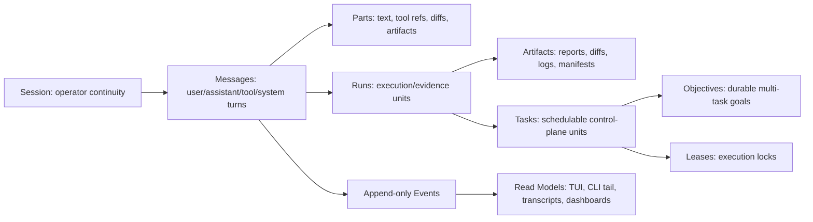
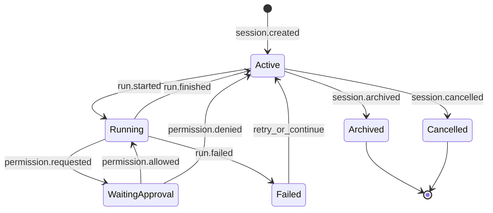

# OpenCode Experience Gap Plan

## Summary

Bring Harness closer to the OpenCode experience while preserving the core Harness structure we already have: Python/Typer CLI, Textual TUI, local SQLite control plane, explicit objectives/tasks/leases, registered adapters, evidence artifacts, safety policies, runtime controls, and approval boundaries.

This is not a rewrite into OpenCode's TypeScript client/server stack. The target is product parity where it matters to the operator:

- a session-first coding loop instead of a command-catalog-first control plane;
- fast model/provider/agent switching;
- interactive permissions and resumable sessions;
- a rich terminal UI with live events, diffs, todos, files, terminals, and approvals in one place;
- a headless local server API for web/desktop/remote clients;
- pluggable tools, MCP, LSP, and skills without bypassing Harness policy.

Upstream reference checked: `anomalyco/opencode` `dev` at commit `c5db39f6268a36194a7fe5f833ae3197dfe250b6` from 2026-05-16.

## Keep

Do not discard these Harness foundations:

- durable project state under `.harness/`;
- declarative built-in specs, workbenches, agents, model profiles, memory scopes, and tool policies;
- durable objectives, tasks, leases, runs, artifacts, progress, baselines, evals, integrity checks, and traces;
- registered execution adapters instead of arbitrary execution;
- hosted-boundary approvals separate from active-repo apply-back;
- runtime controls, adapter breakers, blocked-state explanations, secret/path guards, and evidence manifests;
- existing Codex direct foreground run and isolated edit adapters;
- existing self-managed local action spine.

The plan below adds OpenCode-like surfaces around this structure rather than flattening the safety model.

## Release-Blocking Invariants

These are not implementation preferences. They are release gates for the OpenCode-like work:

- **Persist before display:** no TUI update, CLI live line, permission prompt, tool call, model output, diff, test output, terminal output, or run status may be emitted only in memory. Every user-visible update must be backed by an append-only persisted event or an immutable persisted message/part.
- **Events are append-only:** event records are never updated in place. Corrections, retractions, redactions, summary replacements, retries, and reversions are represented as new events.
- **Messages are mostly immutable:** historical message records and message parts are not rewritten except for narrowly defined metadata repairs. User-visible corrections must use explicit correction/retraction events.
- **Mutable state is projection state:** session title, summary, status, archived flag, token totals, UI preferences, and cached dashboard fields may change, but they must be derivable from or explainable by persisted records/events.
- **Sessions do not grant authority:** sessions are continuity and evidence containers. Tool permissions, hosted-boundary approvals, apply-back, shell/network/MCP/PTY, and active-repo mutation still go through Harness policy, leases, adapters, approvals, runtime controls, and manifests.
- **No hidden provider fallback:** if a selected provider/model/backend cannot run, execution fails visibly or asks for an explicit operator choice. Harness must never silently substitute another provider, model, billing boundary, hosted route, or fallback backend.
- **Server-shaped APIs from the start:** Phase 1 and Phase 2 may run in-process through CLI/TUI, but store/event/service APIs must be written as if a later `harness serve` API and SSE/WebSocket stream will consume the same contracts.

## Canonical Relationship Model

Use one relationship model throughout implementation:

```text
Session
  -> Messages
  -> Parts
  -> Events
  -> linked Runs
  -> linked Tasks / Objectives / Artifacts
```

Rules:

- A session is the operator-facing continuity layer.
- A message is one user, assistant, tool, or system turn inside a session.
- A message may spawn zero or more runs.
- A run is one execution/evidence unit.
- A run may produce zero or more artifacts.
- A task is the schedulable control-plane unit.
- A task may belong to an objective.
- A task may be linked back to the session/message that requested it.
- An artifact is immutable evidence or a generated projection with manifest metadata.
- Memory, approvals, baselines, traces, and runtime controls may be referenced by events, but references do not grant authority.



State model:



## OpenCode Capabilities We Are Missing Or Only Partly Cover

### 1. Session-First Product Spine

OpenCode centers everything on sessions: create, list, continue, fork, archive/delete, share, summarize, export/import, abort, prompt async, message history, message diff, message deletion, part update, revert/unrevert, status, and children.

Harness currently has runs, objectives, tasks, and chat state, but not a first-class session entity that owns an ongoing coding conversation across runs.

Missing:

- persistent chat sessions independent of a single run;
- continue last session and continue by session id;
- fork a session at a message;
- session titles, summaries, token/cost rollups, and archival;
- session-level todos, diffs, and message history;
- session export/import with sanitization;
- session abort tied to live execution;
- shareable session snapshots, even if initially local-only.

### 2. Rich TUI Workflow

OpenCode's terminal/web app has session timeline, composer, request tree, todo dock, permission dock, question dock, revert dock, follow-up dock, file tabs, side panel, terminal panel, command palette, model/theme/settings dialogs, keyboard shortcuts, and multi-language UI strings.

Harness has a Textual dashboard/chat/palette, but the experience is still mostly a control-plane browser plus a prompt.

Missing:

- session timeline as the primary screen;
- live assistant/tool/test/diff stream in the transcript;
- composer with attachments, slash commands, agent/model selector, and prompt history;
- visible permission queue and question queue;
- todo dock tied to the active session;
- revert/apply-back dock tied to changed files;
- file/diff tabs and changed-file navigation;
- integrated terminal/PTY panel;
- command palette that executes safe UI actions, not only shows copyable commands;
- configurable keyboard shortcuts;
- themes and terminal font settings;
- persistent UI preferences.

### 3. Provider And Model Management

OpenCode is provider-agnostic. It supports provider auth, model listing, model metadata, model variants, model costs, context limits, modalities, reasoning support, and custom provider definitions.

Harness primarily delegates to Codex CLI and has local OpenAI-compatible support in limited places. It does not yet provide a broad provider/model catalog.

Missing:

- `providers list/login/logout` equivalent;
- `models list --provider --verbose --refresh` equivalent;
- local model catalog cache with cost/context/capability metadata;
- provider credentials status without secret leakage;
- model variants/reasoning-effort mapping per provider;
- default model and small model selection;
- disabled/enabled provider filters;
- custom OpenAI-compatible providers from config;
- per-session model switch and persisted model choice.

### 4. Built-In Agents And Subagents

OpenCode has native primary agents `build` and `plan`, plus subagents such as `general`, `explore`, and experimental `scout`. Agents carry their own model, prompt, tool permissions, mode, color, temperature/top-p, step limits, and visibility. It can generate new agent configs.

Harness has declarative agents and workbenches, but the interactive app does not yet feel like switching between active coding modes.

Missing:

- first-class `build` and `plan` UX in the TUI, with `Tab` or equivalent switching;
- subagent invocation from a message, for example `@general` or `@explore`;
- parallel subagent runs represented in the session timeline;
- generated custom agents from a natural-language description;
- agent-specific tool permission overlays;
- agent visibility, colors, and concise descriptions in selector UI;
- hidden utility agents for title/summary/compaction.

### 5. Tool Surface

OpenCode exposes built-in tools for shell, read, glob, grep, edit, write, task, task status, web fetch, web search, todo, skill, patch, question, LSP, repo clone, and repo overview, plus custom plugin tools.

Harness currently has read-only tools, patch validation, Docker tests, Codex adapters, chat tools, and managed local actions. It intentionally avoids arbitrary shell and broad active writes.

Missing or partial:

- permissioned shell tool with interactive approval;
- direct edit/write tools behind policy instead of only patch/apply-back flows;
- glob/grep/read as first-class session tools in live transcripts;
- todo write/read surfaced as session state;
- question tool for model-to-user clarification;
- web fetch and web search behind explicit network policy;
- LSP diagnostics/symbol lookup tool;
- repo clone and repo overview into managed external cache;
- skill loading as a runtime tool;
- custom local tool discovery and plugin tool registry;
- truncation of large tool outputs to artifacts with preview in transcript.

### 6. Permission Model

OpenCode supports per-tool and per-target `allow`, `ask`, and `deny` rules, including path-sensitive read/edit/external-directory rules. It has a dangerous skip-permissions mode.

Harness has strong approval and policy concepts, but they are oriented around adapters/tasks rather than interactive tool calls inside a session.

Missing:

- one normalized interactive permission request table;
- per-session permission snapshots;
- per-tool/path `allow/ask/deny` policy overlays;
- UI permission responses that unblock running sessions;
- "ask once/always allow for this session/deny" style responses;
- permission reasoning in the live stream;
- a deliberately named unsafe bypass mode for development only, if we choose to support it.

### 7. Client/Server Architecture

OpenCode runs a local server with typed HTTP routes, OpenAPI generation, event streams, WebSockets, auth, CORS, mDNS, remote attach, web UI, and desktop UI.

Harness is mainly a CLI/TUI process with local files. It does not yet expose a stable local API.

Missing:

- `harness serve` headless local server;
- `harness web` to open a browser client;
- typed local HTTP API for sessions, runs, artifacts, providers, agents, permissions, files, config, workspaces, and events;
- WebSocket or SSE event feed for live sessions/runs;
- OpenAPI document generation;
- local server auth token/password;
- remote attach from CLI/TUI to an existing server;
- lifecycle/dispose endpoint;
- optional mDNS advertisement for LAN clients;
- web/desktop client boundary, even if the first implementation is minimal.

### 8. File, Reference, And Attachment UX

OpenCode supports file search/list/content/status endpoints, symbol search, references, instruction files, attachments, image handling, and prompt mentions.

Harness has context packing and read tools, but not a polished file/reference experience.

Missing:

- file finder and content API for the TUI/server;
- symbol finder backed by LSP where available;
- prompt `@file`, `@directory`, `@agent`, `@reference`, and `@session` mentions;
- configured named references to local/git directories;
- attachments through CLI and TUI;
- image attachment processing limits/resizing;
- instruction file discovery beyond current packaged specs;
- context budget visualization before send.

### 9. LSP And Formatter Integration

OpenCode has opt-in LSP and formatter configuration, LSP server launch, diagnostics, and language support.

Harness has no first-class LSP/formatter layer.

Missing:

- built-in LSP configuration model;
- LSP process manager;
- diagnostics collection;
- symbol search and go-to-reference;
- expose diagnostics to the model as a tool and to the TUI as a panel;
- formatter discovery/configuration;
- optional formatting after accepted edits.

### 10. MCP And Plugins

OpenCode supports local and remote MCP servers, OAuth authentication, MCP resources, MCP status, plugin loading, and plugin tools.

Harness currently declares MCP/A2A out of v1 scope.

Missing:

- MCP server config for local command and remote URL;
- MCP connect/disconnect/status;
- MCP OAuth start/callback/logout;
- MCP resource listing;
- MCP tool registration into the Harness tool registry;
- plugin discovery under project/global config;
- plugin install/update/remove commands;
- plugin metadata and safety review;
- plugin-origin tracking so local and global plugin scopes remain auditable.

### 11. Shell And PTY

OpenCode has managed PTY sessions, shell listing, create/update/remove, WebSocket connection tokens, and a terminal panel.

Harness can run controlled Docker tests and Codex subprocesses, but not user-visible terminals.

Missing:

- managed PTY service;
- terminal tabs in TUI/web;
- shell selection and acceptability checks;
- terminal output serialization/restoration;
- process cleanup and session ownership;
- permission boundary between terminal commands and model tools.

### 12. Worktrees, Snapshots, Revert, And Apply

OpenCode uses snapshots, session diffs, revert/unrevert, worktree create/remove/reset, and VCS apply endpoints.

Harness has isolated apply-back, diff inspection, baselines, and artifacts, but not a session-native undo/revert model.

Missing:

- per-message snapshot ids;
- revert/unrevert a message's file effects;
- active session changed-files summary;
- worktree create/remove/reset commands;
- apply selected diff hunks from UI;
- active repo diff status endpoint;
- Git PR checkout/run flow similar to `opencode pr`.

### 13. Commands, Slash Commands, And Custom Commands

OpenCode supports built-in and configured commands, slash command execution, command templates, and project-local `.opencode/command`.

Harness has slash commands and workflow templates, but not user-defined command discovery.

Missing:

- project/global command config;
- command template variables;
- command listing in palette and slash menu;
- user-defined slash commands;
- built-in `/init`, `/review`, commit/changelog-style commands;
- deterministic command execution through the same session spine.

### 14. Sync, Sharing, And Multi-Workspace

OpenCode has sharing modes, sync history/replay/steal, workspace adapters, and control-plane workspace state.

Harness has local artifacts and no remote sync/sharing.

Missing:

- local session share export with sanitization;
- optional hosted/share URL integration, if desired later;
- multi-workspace project registry;
- sync/replay primitives;
- workspace routing in the local API;
- conflict handling when multiple clients attach.

### 15. Distribution And Desktop

OpenCode ships install scripts, npm package, Homebrew, Scoop/Chocolatey, Nix, Arch, desktop beta packages, upgrade/uninstall commands, and auto-update/notify settings.

Harness currently packages as a Python project and console script.

Missing:

- install script or single-file bootstrap;
- upgrade/uninstall commands;
- version check and update notifications;
- desktop packaging decision;
- binary/wheel distribution smoke beyond local package checks;
- platform-specific docs and install paths.

## Roadmap

### Phase 0 - Product Contract And Safety Mapping

Goal: define the OpenCode-like experience in Harness terms before implementation spreads across modules.

Deliverables:

- Document the canonical `Session -> Messages/Parts/Events -> Runs -> Tasks/Objectives/Artifacts` relationship model and state machine.
- Define `SessionRecord`, `SessionMessageRecord`, `SessionPartRecord`, `SessionTodoRecord`, and `SessionPermissionRequest` models.
- Define the event contract shared by sessions and runs: model messages, tool calls, permission requests, questions, todo updates, diffs, terminal output, token usage, and summaries.
- Define append-only event/message immutability rules.
- Define schema migration versioning and the initial `schema_migrations` requirement.
- Define permission scope/source/expiry/revocation semantics.
- Define tool-output storage thresholds and artifact overflow rules.
- Map OpenCode tools to Harness risk classes and policies.
- Decide which features are enabled by default and which are experimental.
- Add a migration plan for existing runs/objectives into session views without changing their storage initially.

Acceptance:

- One architecture doc section states how sessions relate to objectives, tasks, leases, runs, artifacts, and memory.
- The replay contract is explicit: no live UI/CLI output exists only in memory.
- No existing adapter permission is broadened.
- Tests can validate schema round-trips for the new session/event models.

### Phase 1 - Persistent Sessions And Continue/Fork UX

Goal: make Harness feel like a coding assistant first, while keeping objectives/tasks underneath.

Deliverables:

- Add versioned migrations for sessions, messages, message parts, session todos, session permissions, and the append-only event store.
- Add CLI commands: `harness session list|get|archive|delete|fork|export --metadata-only`.
- Add prompt options: `--continue`, `--session`, `--fork`, `--title`, `--agent`, `--model`, `--file`, and temporary `--no-session`.
- Route foreground prompt and chat runs through a session id.
- Persist model-visible transcript summaries and final assistant messages.
- Add token/cost placeholders even before full provider catalog exists.

Acceptance:

- `harness "..." --continue` resumes the most recent session.
- `harness session fork <id> --message <message_id>` creates a child session.
- `harness "..."` creates a new session by default while preserving the existing direct Codex execution behavior.
- `--no-session` preserves a temporary compatibility/debug path.

### Phase 2 - Live Session Timeline In CLI And TUI

Goal: render one authoritative stream across CLI, TUI, transcripts, and final reports.

Deliverables:

- Extend the existing live artifact/event work into session-owned events.
- Show tool calls, tool results, diffs, tests, model deltas, token usage, blocked states, permissions, and final summary.
- Add `harness session tail <id>` and `harness events <run_or_session_id> --follow`.
- Promote session timeline to the main Textual screen.
- Add composer, session list, active run status, and changed-file panel.

Acceptance:

- Human and JSONL streams render from the same persisted events.
- TUI can reconnect and replay a session from SQLite/artifacts.
- No raw hidden reasoning is displayed.

### Phase 3 - Build/Plan Agents And Subagents

Goal: provide OpenCode-style agent switching without losing Harness specs.

Deliverables:

- Add native aliases: `build`, `plan`, `general`, `explore`.
- Map `build` to isolated Codex edit by default, preserving inspected diff and apply-back boundaries.
- Keep direct active-workspace Codex available only through explicit direct mode or adapter choice.
- Map `plan` first to a lightweight read-only session tool loop with read/glob/grep/artifact-read only.
- Add `@agent` mention parsing in prompts.
- Represent subagent work as child session branches or child tasks linked to the parent session.
- Add agent selector to TUI and `--agent` to foreground prompts.
- Add agent generation command that creates a Harness agent bundle from a description.

Acceptance:

- Operator can switch between `build` and `plan` inside TUI.
- `@general` can run bounded research in parallel and return an artifact-backed summary.
- Plan mode denies active edits by default.

### Phase 4A - Read And Session-Local Tools

Goal: add low-risk OpenCode-like tools through Harness policy before introducing mutation, shell, network, MCP, or PTY.

Deliverables:

- Add a session tool registry with tool descriptors, JSON schemas, side-effect levels, replay policy, and permission keys.
- Register read, glob, grep, artifact-read, policy-explain, todo, and question tools first.
- Add permission request persistence and UI responses.
- Add path-sensitive `allow/ask/deny` rules.
- Add large-output truncation to artifacts.

Acceptance:

- A denied tool call records evidence and returns a recoverable model observation.
- A permission response can unblock a paused session.
- Read/glob/grep/todo/question tools appear in the live transcript.
- These tools do not mutate the active repository, call external network, invoke shell, or call MCP.

### Phase 4B - Mutation, Execution, Network, And External Tools

Goal: introduce higher-risk tools only after Phase 4A permission semantics are stable.

Deliverables:

- Register patch, managed local actions, Docker test, direct edit/write, shell, web fetch/search, MCP, PTY, and external repo tools as separate subgated capabilities.
- Require explicit permission and policy evaluation for every mutation/network/execution tool call.
- Keep direct edit/write behind blocked-path checks and apply-back/snapshot rules.
- Keep shell and PTY approval-required by default, with no model auto-run unless policy explicitly allows it.
- Keep web/MCP/repo-clone tools behind external-network approval.

Acceptance:

- Mutation tools emit permission decisions, tool events, artifacts, and run/session links.
- Denied or expired permissions stop the tool call and leave a replayable event trail.
- No high-risk tool can bypass Harness adapters, approvals, runtime controls, or manifests.

### Phase 5 - Provider And Model Catalog

Goal: make model choice explicit and portable.

Deliverables:

- Add provider/model config schema and SQLite cache.
- Add `harness providers list|login|logout|status`.
- Add `harness models list --provider --verbose --refresh`.
- Support OpenAI-compatible local/remote providers through config.
- Preserve existing Codex CLI backend as one provider/backend option.
- Add model selector and model metadata to the TUI.
- Enforce explicit failure on unavailable provider/model selections; do not silently fall back to another provider, model, billing boundary, hosted route, or local route.

Acceptance:

- Session records store provider/model/variant.
- Model list shows context limit, tool support, reasoning support, modalities, and cost when known.
- Provider credentials status never prints secrets.
- Model override behavior is deterministic and auditable in session events.

### Phase 6 - Headless Local Server

Goal: unlock OpenCode-like web/desktop/remote clients.

Design constraint: Phase 1 and Phase 2 service/event APIs should already be shaped so this phase wraps stable contracts instead of rewriting Textual-specific persistence paths.

Deliverables:

- Add `harness serve` with local token auth.
- Add typed endpoints for health, sessions, messages, events, files, agents, providers, models, permissions, artifacts, and config.
- Add SSE/WebSocket event stream.
- Add OpenAPI generation.
- Add `harness web` as a lightweight browser launcher once a web client exists.
- Add remote attach mode for CLI/TUI.

Acceptance:

- TUI can optionally attach to an already-running local server.
- `curl` can create a session, send a prompt, and stream events with auth.
- OpenAPI output is checked in tests.

### Phase 7 - File, Reference, Attachment, LSP, And Formatter UX

Goal: make context selection feel fast and code-aware.

Deliverables:

- Add file finder/content/status endpoints.
- Add `@file`, `@directory`, `@reference`, and `@session` mentions.
- Add attachment support for CLI/TUI with size/type policy.
- Add named local/git references.
- Add opt-in LSP manager and diagnostics/symbol tools.
- Add formatter config and optional format-on-accepted-edit.

Acceptance:

- Composer can attach a file and show context byte/token estimate.
- LSP diagnostics can be shown in TUI and used by a read-only tool.
- Mention resolution is persisted in session events.

### Phase 8 - MCP, Plugins, Skills, And Web Tools

Goal: add extensibility with auditability.

Deliverables:

- Add MCP config for local and remote servers.
- Add `harness mcp list|add|auth|logout|connect|disconnect|resources`.
- Register MCP tools/resources through the same session tool registry.
- Add project/global plugin discovery and install/update/remove.
- Add skill discovery and skill-load tool.
- Add web fetch/search tools behind explicit network policy.

Acceptance:

- MCP tool calls produce the same permission/evidence records as built-ins.
- Network tools are denied or approval-required unless policy enables them.
- Plugin origin and scope are visible in diagnostics.

### Phase 9 - PTY, Worktrees, Snapshots, And Revert

Goal: support the full interactive development loop.

Deliverables:

- Add managed PTY sessions with terminal tabs.
- Add shell selection and terminal output restoration.
- Add git worktree create/remove/reset.
- Add per-message snapshots.
- Add session diff, revert, unrevert, and selected hunk apply.
- Add PR checkout/run helper.

Acceptance:

- A session can run with a terminal open beside the assistant timeline.
- File effects from a message can be reverted through CLI/TUI.
- Worktree operations are visible and policy-gated.

### Phase 10 - Distribution, Desktop, And Polish

Goal: reduce friction and match OpenCode's installation and client breadth.

Deliverables:

- Add install/upgrade/uninstall commands.
- Add version check and update notification mode.
- Decide packaging path: Python wheel only, standalone binary, or desktop wrapper.
- Add desktop/web roadmap only after the local server is stable.
- Improve command palette, themes, keybindings, and settings.

Acceptance:

- A new user can install and start the app with one documented path.
- Existing local development install still works.
- Packaging smoke covers the new CLI/server/session paths.

## Implementation Order

Recommended order:

1. Phase 0
2. Phase 1
3. Phase 2
4. Phase 3
5. Phase 4A
6. Phase 4B
7. Phase 5
8. Phase 6
9. Phase 7
10. Phase 8
11. Phase 9
12. Phase 10

Reasoning:

- Sessions and events are the foundation for almost every OpenCode-like surface.
- TUI improvements need persistent session state first.
- Agents and tools need a session-owned permission model before broadening capabilities.
- Read/session-local tools should land before mutation, shell, network, MCP, and PTY tools.
- Provider catalog and server can follow once session semantics are stable.
- MCP/plugins/LSP/PTY/worktrees should wait until the core session and permission spine can audit them.

## Session Spine MVP

The first implementation milestone should be small and shippable:

- `SessionRecord` and message tables;
- append-only event store and replay for session-visible events;
- versioned migration runner with `schema_migrations`;
- `harness session list|get|archive`;
- `harness session export --metadata-only`;
- `harness "prompt" --continue`;
- session id attached to direct Codex foreground runs;
- persisted final assistant message and run link;
- active-workspace direct runs recorded as non-reversible session messages;
- TUI read-only session list plus active transcript replay;
- tests for migration, CLI commands, and event replay.

Out of scope for the first milestone:

- provider catalog;
- arbitrary shell;
- MCP;
- LSP;
- web server;
- desktop app;
- share URLs;
- `session import`;
- artifact bundling in export;
- hard session purge;
- active-repo revert.

## Detail Strategy

Only the foundation phases should be deeply specified now.

Detailed now:

- Phase 0, because it defines the product contract, data ownership, safety invariants, and event semantics.
- Phase 1, because it is the first implementation milestone and should be decomposed into files, commands, migrations, and tests.
- Phase 2, because the live timeline depends directly on Phase 1 and we already know the event-rendering contract.

Keep lighter for now:

- Phases 3-10 should stay at roadmap depth until sessions, events, and interactive permissions exist. Those later phases depend on real implementation feedback from the session spine. Over-specifying MCP, desktop, PTY, plugins, and LSP before that point would create stale design detail.

## Phase 0 Detailed Plan - Product Contract

Phase 0 should be implemented as design-plus-schema work, with small tests but minimal product behavior.

### Phase 0.1 Session Ownership Contract

Define how the new session layer relates to existing Harness concepts:

- A session is the operator-facing conversation and activity container.
- A run is one execution attempt or evidence-producing unit that may belong to a session.
- An objective is a durable multi-task goal that may be created from a session and linked back to it.
- A task is still the schedulable control-plane unit.
- A lease remains the execution lock for a task.
- An artifact remains the durable evidence record for files, reports, transcripts, diffs, manifests, and restricted outputs.
- Memory remains explicit, local, scoped, and non-authoritative.
- Permissions are session-visible decisions but never become hidden grants outside their stored scope.

Invariants:

- Every session event must be replayable without calling a provider, shell, Docker, or network.
- Every user-visible live update must have a persisted event or persisted message source before display.
- Events are append-only and historical message parts are immutable except for explicit correction/retraction events.
- A session can reference runs, objectives, tasks, leases, artifacts, memory records, and approvals, but references do not grant authority.
- A run can exist without a session for backward compatibility.
- A session can exist without runs for local notes, planning, or imported history.
- Active-repo mutation remains governed by existing foreground run behavior or explicit apply-back rules.
- Active-workspace direct runs are recordable in the session transcript but marked non-reversible.
- Hidden reasoning is never persisted as visible transcript content.
- Session/service APIs should remain independent of Textual so `harness serve` can expose the same contract later.

### Phase 0.2 Proposed Models

Add Pydantic models in [models.py](/Users/oscarxue/Documents/harness/src/harness/models.py) or a new `session_models.py` if the file becomes too broad.

Proposed model names:

```python
class SessionRecord(BaseModel):
    schema_version: Literal["harness.session/v1"] = "harness.session/v1"
    id: str
    title: str
    status: SessionLifecycleStatus
    project_root: Path
    parent_session_id: str | None = None
    forked_from_message_id: str | None = None
    agent_id: str | None = None
    provider_id: str | None = None
    model_id: str | None = None
    model_variant: str | None = None
    raw_model_ref: str | None = None
    summary: str | None = None
    ui_preferences: dict[str, Any] = Field(default_factory=dict)
    token_input: int = 0
    token_output: int = 0
    token_reasoning: int = 0
    token_cache_read: int = 0
    token_cache_write: int = 0
    estimated_cost_usd: Decimal | None = None
    created_at: datetime
    updated_at: datetime
    archived_at: datetime | None = None


class SessionMessageRecord(BaseModel):
    schema_version: Literal["harness.session_message/v1"] = "harness.session_message/v1"
    id: str
    session_id: str
    parent_message_id: str | None = None
    role: Literal["user", "assistant", "tool", "system"]
    agent_id: str | None = None
    run_id: str | None = None
    objective_id: str | None = None
    mutation_reversibility: Literal[
        "none",
        "not_reversible_active_workspace",
        "reversible_snapshot",
        "reversible_isolated_workspace",
        "unknown",
    ] = "none"
    created_at: datetime
    content_preview: str


class SessionPartRecord(BaseModel):
    schema_version: Literal["harness.session_part/v1"] = "harness.session_part/v1"
    id: str
    session_id: str
    message_id: str
    kind: SessionPartKind
    ordinal: int
    text: str | None = None
    artifact_id: str | None = None
    run_id: str | None = None
    metadata: dict[str, Any] = Field(default_factory=dict)
    redaction_state: RedactionState = RedactionState.NOT_REQUIRED


class SessionTodoRecord(BaseModel):
    schema_version: Literal["harness.session_todo/v1"] = "harness.session_todo/v1"
    id: str
    session_id: str
    content: str
    status: Literal["pending", "in_progress", "completed", "cancelled"]
    priority: int = 0
    source_message_id: str | None = None
    updated_at: datetime


class SessionPermissionRequest(BaseModel):
    schema_version: Literal["harness.session_permission/v1"] = "harness.session_permission/v1"
    id: str
    session_id: str
    run_id: str | None = None
    tool_id: str
    normalized_action: str
    normalized_target_pattern: str
    boundary_kind: Literal[
        "local_only",
        "hosted_provider",
        "external_network",
        "active_repo_write",
        "shell",
        "mcp",
        "pty",
    ]
    risk: str
    status: Literal["pending", "allowed", "denied", "expired", "cancelled"]
    scope: Literal["once", "session", "project", "profile"]
    source: Literal["user", "policy", "config", "approval_profile"]
    revocable: bool = True
    requested_at: datetime
    resolved_at: datetime | None = None
    expires_at: datetime
    policy_reasons: list[str] = Field(default_factory=list)
```

Proposed enums:

- `SessionLifecycleStatus`: `active`, `idle`, `waiting_approval`, `running`, `completed`, `failed`, `cancelled`, `archived`.
- `SessionPartKind`: `text`, `model_delta`, `reasoning_summary`, `tool_call`, `tool_result`, `permission_request`, `question`, `todo_update`, `diff`, `test_output`, `terminal_output`, `artifact_ref`, `run_ref`, `summary`.

Permission semantics:

- Permission identity is the tuple `tool_id + normalized_action + normalized_target_pattern + boundary_kind`.
- Scope is one of `once`, `session`, `project`, or `profile`.
- Source is one of `user`, `policy`, `config`, or `approval_profile`.
- Every permission has `expires_at`; default pending permission expiry is 15 minutes or session/run abort, whichever comes first.
- Session-scoped allow decisions expire when the session is archived/closed or after a maximum wall-clock cap of 24 hours.
- Longer expiries are allowed only when explicitly tied to a task lease or approval profile.
- All permission decisions are revocable and must emit append-only events.
- "Always allow" UI language must compile to an auditable, scoped, expiring Harness permission decision. It must never become an unbounded hidden grant.

### Phase 0.3 Event Contract

Extend the existing live event thinking in [live_artifacts.py](/Users/oscarxue/Documents/harness/src/harness/live_artifacts.py) into a hard persistence primitive. Session events are not a UI feature; they are the canonical replay and audit spine for the OpenCode-like experience.

Event envelope:

```json
{
  "schema_version": "harness.event/v2",
  "event_id": "evt_...",
  "stream_type": "session",
  "stream_id": "session_...",
  "session_id": "session_...",
  "run_id": "run_...",
  "task_id": "task_...",
  "message_id": "msg_...",
  "seq": 12,
  "occurred_at": "2026-05-16T12:00:00Z",
  "kind": "tool_call.started",
  "actor": {
    "type": "tool_gateway",
    "id": "gateway.local"
  },
  "correlation_id": "corr_...",
  "causation_id": "evt_...",
  "visibility": "user_visible",
  "redaction_state": "redacted",
  "payload": {},
  "artifact_refs": []
}
```

Initial event types:

- `session.created`
- `session.updated`
- `message.created`
- `message.part.created`
- `run.linked`
- `run.started`
- `run.finished`
- `model.message_delta`
- `reasoning.summary_delta`
- `tool_call.started`
- `tool_call.output`
- `tool_call.finished`
- `permission.requested`
- `permission.resolved`
- `question.requested`
- `question.resolved`
- `todo.updated`
- `diff.updated`
- `test.started`
- `test.output`
- `test.finished`
- `artifact.registered`
- `token_usage.updated`
- `session.summary_updated`

Event rules:

- `seq` is strictly increasing per stream.
- `stream_type` can be `session`, `run`, `task`, `artifact`, `permission`, or later extension streams.
- Session-visible events must include `session_id`.
- Run-visible events should include `run_id`; task-driven runs should include `task_id`.
- JSONL output has no ANSI escape codes.
- Human output is rendered from persisted event data.
- Restricted or blocked payloads may be referenced by artifact id but not printed.
- Raw hidden reasoning is never an event payload.
- TUI and CLI streaming subscribe to persisted events or an event-store tail. They do not stream directly from volatile in-memory callbacks.
- Existing run JSONL files remain projections/exports. They are not the long-term source of truth once the event store exists.

### Phase 0.4 Output Storage Limits

Set tool/model/test output thresholds before implementation so large outputs do not leak through transcripts or event payloads.

Default limits:

- Transcript preview: 16 KiB per message part.
- Event payload: 64 KiB serialized JSON maximum.
- Tool result inline preview: 16 KiB.
- Test output inline preview: 16 KiB per event, with additional output stored as an artifact.
- Artifact inline text preview: 256 KiB maximum.
- JSONL segment target: 16 MiB or 10,000 events before rotation/export segmentation.

For any payload above the inline threshold:

- write the full output as an artifact;
- store SHA-256, byte size, content type, redaction state, producer, and source event id;
- keep only a preview and artifact reference in the event/message part;
- never bypass secret/path redaction for artifact previews.

### Phase 0.5 Safety Mapping

Map OpenCode-style tools into Harness authority categories:

| OpenCode-like capability | Initial Harness status | Policy |
| --- | --- | --- |
| read/glob/grep | implement early | read-only, auto-allowed inside project, guarded outside project |
| todo/question | implement early | session-local, no repo mutation |
| patch/apply diff | partial existing | approval or explicit action path |
| direct edit/write | defer | requires interactive permission and blocked path checks |
| shell/PTY | defer | approval-required, no model auto-run by default |
| web fetch/search | defer | external network approval-required |
| LSP diagnostics | defer after session spine | read-only once configured |
| MCP tools | defer | same policy envelope as built-ins |
| repo clone/overview | defer | managed external cache, network approval |

Phase 0 output should include this mapping in code comments or tests only where it affects executable policy. The planning doc is the main design source.

Agent defaults:

- `build` maps to isolated Codex edit by default, preserving the apply-back boundary.
- Direct active-workspace Codex remains available only through an explicit direct mode or adapter choice, and is recorded as `not_reversible_active_workspace`.
- `plan` maps first to a lighter read-only session tool loop using read/glob/grep/artifact-read only.
- `plan` may later delegate to the heavier `repo_planning` adapter, but it should not start there if the user only wants interactive exploration.

## Phase 1 Detailed Plan - Persistent Sessions

Phase 1 should deliver a small but usable session layer.

### Phase 1.1 Storage Migration

Update [schema.sql](/Users/oscarxue/Documents/harness/src/harness/memory/schema.sql), add versioned migration files under a new migration directory, and update [sqlite_store.py](/Users/oscarxue/Documents/harness/src/harness/memory/sqlite_store.py) to run migrations before opening normal store operations.

Migration requirement:

- Add a `schema_migrations` table now.
- Use ordered migration ids such as `20260516_001_sessions`.
- `CREATE TABLE IF NOT EXISTS` is acceptable inside the first additive migration, but future phases must be tracked by migration id and checksum.
- Startup should fail closed on an unknown future schema version instead of silently mutating state.

Tables:

```sql
CREATE TABLE IF NOT EXISTS schema_migrations (
  id TEXT PRIMARY KEY,
  checksum TEXT NOT NULL,
  applied_at TEXT NOT NULL,
  metadata_json TEXT NOT NULL DEFAULT '{}'
);

CREATE TABLE IF NOT EXISTS sessions (
  id TEXT PRIMARY KEY,
  title TEXT NOT NULL,
  status TEXT NOT NULL,
  project_root TEXT NOT NULL,
  parent_session_id TEXT,
  forked_from_message_id TEXT,
  agent_id TEXT,
  provider_id TEXT,
  model_id TEXT,
  model_variant TEXT,
  raw_model_ref TEXT,
  summary TEXT,
  ui_preferences_json TEXT NOT NULL DEFAULT '{}',
  token_input INTEGER NOT NULL DEFAULT 0,
  token_output INTEGER NOT NULL DEFAULT 0,
  token_reasoning INTEGER NOT NULL DEFAULT 0,
  token_cache_read INTEGER NOT NULL DEFAULT 0,
  token_cache_write INTEGER NOT NULL DEFAULT 0,
  estimated_cost_usd TEXT,
  created_at TEXT NOT NULL,
  updated_at TEXT NOT NULL,
  archived_at TEXT
);

CREATE TABLE IF NOT EXISTS session_messages (
  id TEXT PRIMARY KEY,
  session_id TEXT NOT NULL,
  parent_message_id TEXT,
  role TEXT NOT NULL,
  agent_id TEXT,
  run_id TEXT,
  objective_id TEXT,
  mutation_reversibility TEXT NOT NULL DEFAULT 'none',
  content_preview TEXT NOT NULL,
  created_at TEXT NOT NULL,
  FOREIGN KEY (session_id) REFERENCES sessions(id)
);

CREATE TABLE IF NOT EXISTS session_parts (
  id TEXT PRIMARY KEY,
  session_id TEXT NOT NULL,
  message_id TEXT NOT NULL,
  kind TEXT NOT NULL,
  ordinal INTEGER NOT NULL,
  text TEXT,
  artifact_id TEXT,
  run_id TEXT,
  metadata_json TEXT NOT NULL DEFAULT '{}',
  redaction_state TEXT NOT NULL,
  created_at TEXT NOT NULL,
  FOREIGN KEY (session_id) REFERENCES sessions(id),
  FOREIGN KEY (message_id) REFERENCES session_messages(id)
);

CREATE TABLE IF NOT EXISTS session_run_links (
  session_id TEXT NOT NULL,
  run_id TEXT NOT NULL,
  message_id TEXT,
  created_at TEXT NOT NULL,
  PRIMARY KEY (session_id, run_id)
);

CREATE TABLE IF NOT EXISTS event_store (
  id TEXT PRIMARY KEY,
  stream_type TEXT NOT NULL,
  stream_id TEXT NOT NULL,
  seq INTEGER NOT NULL,
  kind TEXT NOT NULL,
  visibility TEXT NOT NULL,
  redaction_state TEXT NOT NULL,
  session_id TEXT,
  message_id TEXT,
  run_id TEXT,
  task_id TEXT,
  artifact_id TEXT,
  actor_json TEXT NOT NULL DEFAULT '{}',
  correlation_id TEXT,
  causation_id TEXT,
  payload_json TEXT NOT NULL,
  artifact_refs_json TEXT NOT NULL DEFAULT '[]',
  created_at TEXT NOT NULL,
  UNIQUE(stream_type, stream_id, seq)
);

CREATE TABLE IF NOT EXISTS session_todos (
  id TEXT PRIMARY KEY,
  session_id TEXT NOT NULL,
  content TEXT NOT NULL,
  status TEXT NOT NULL,
  priority INTEGER NOT NULL DEFAULT 0,
  source_message_id TEXT,
  created_at TEXT NOT NULL,
  updated_at TEXT NOT NULL,
  FOREIGN KEY (session_id) REFERENCES sessions(id)
);

CREATE TABLE IF NOT EXISTS session_permissions (
  id TEXT PRIMARY KEY,
  session_id TEXT NOT NULL,
  run_id TEXT,
  tool_id TEXT NOT NULL,
  normalized_action TEXT NOT NULL,
  normalized_target_pattern TEXT NOT NULL,
  boundary_kind TEXT NOT NULL,
  risk TEXT NOT NULL,
  status TEXT NOT NULL,
  scope TEXT NOT NULL,
  source TEXT NOT NULL,
  revocable INTEGER NOT NULL DEFAULT 1,
  policy_reasons_json TEXT NOT NULL DEFAULT '[]',
  requested_at TEXT NOT NULL,
  resolved_at TEXT,
  expires_at TEXT NOT NULL,
  FOREIGN KEY (session_id) REFERENCES sessions(id)
);
```

Indexes:

- `sessions(updated_at DESC)`
- `sessions(status, updated_at DESC)`
- `session_messages(session_id, created_at)`
- `session_parts(message_id, ordinal)`
- `event_store(stream_type, stream_id, seq)`
- `event_store(session_id, seq)`
- `event_store(run_id, seq)`
- `session_run_links(run_id)`
- `session_todos(session_id, status)`
- `session_permissions(session_id, status)`
- `session_permissions(tool_id, normalized_action, boundary_kind, status)`

Migration rules:

- Use additive `CREATE TABLE IF NOT EXISTS` changes in the first migration, then track all future DDL through versioned migrations.
- Do not rewrite existing runs, tasks, objectives, leases, approvals, memory, or artifacts.
- Existing run listing and artifact commands must behave identically.
- A missing session table in older `.harness` state should be repaired by `harness init --project .` without deleting existing data.
- Existing run JSONL and session JSONL files, where present, should be treated as projections/exports during this phase.
- Add migration tests for idempotency, ordered application, checksum mismatch, and unknown future migration handling.

### Phase 1.2 Store API

Add methods to `SQLiteStore`:

- `create_session(...) -> SessionRecord`
- `list_sessions(include_archived=False, limit=50) -> list[SessionRecord]`
- `get_session(session_id) -> SessionRecord`
- `update_session(session_id, **fields) -> SessionRecord`
- `archive_session(session_id) -> SessionRecord`
- `delete_session(session_id) -> bool`
- `latest_session() -> SessionRecord | None`
- `fork_session(session_id, message_id=None, title=None) -> SessionRecord`
- `append_session_message(...) -> SessionMessageRecord`
- `append_session_part(...) -> SessionPartRecord`
- `link_run_to_session(session_id, run_id, message_id=None) -> None`
- `append_event(stream_type, stream_id, kind, payload, ...) -> dict`
- `list_events(stream_type, stream_id, after_seq=None, limit=None) -> list[dict]`
- `list_session_events(session_id, after_seq=None, limit=None) -> list[dict]`
- `list_session_messages(session_id, limit=None, before=None) -> list[SessionMessageRecord]`
- `list_session_parts(message_id) -> list[SessionPartRecord]`

Implementation rules:

- Store methods sanitize previews before persistence.
- Full text can be persisted in parts only when redaction allows it.
- Artifact references should be preferred for long output.
- Event append must allocate sequence numbers inside a transaction.
- Event records must not be updated in place.

### Phase 1.3 CLI Contract

Add a new Typer app named `session`. Preserve `sessions` as an alias if existing scripts or tests may rely on plural naming, but use singular in docs and help output.

Commands:

```bash
harness session list --project .
harness session get session_abc123 --project .
harness session archive session_abc123 --project .
harness session delete session_abc123 --project .  # alias for archive in the MVP
harness session fork session_abc123 --message msg_abc123 --project .
harness session export session_abc123 --metadata-only --sanitize --project .
harness session tail session_abc123 --project .
```

Prompt flags:

```bash
harness "fix the failing tests" --project .
harness "continue this work" --project . --continue
harness "try another approach" --project . --session session_abc123 --fork
harness "use the plan agent" --project . --agent plan
harness "attach this file" --project . --file src/harness/chat.py
harness "override model" --project . --model codex/gpt-5.5
harness "debug without session persistence" --project . --no-session
```

Behavior:

- No session flags: create a new session for foreground prompt runs by default.
- `--no-session`: temporary compatibility/debug escape hatch. It should not become the recommended product path.
- `--continue`: load the most recently updated non-archived session.
- `--session`: append to that session.
- `--fork`: create a child session before running.
- `--title`: set the session title.
- `--file`: in Phase 1, record attachment metadata only if implementing full attachment ingest would widen scope.
- `--agent`: store the chosen agent id even if execution still maps to existing adapters.
- `--model`: store `raw_model_ref` as opaque text and parse obvious `provider_id`, `model_id`, and `variant` fields when possible.
- Unknown model strings may persist in the session record but must not trigger provider fallback.
- `delete`: archive by default and print that the session was archived. Add a later destructive `purge` command with `--confirm <session_id>` for hard deletion.
- `export --metadata-only`: include session metadata, transcript JSON, event JSONL, and artifact references only. Do not bundle artifact files until a later `--include-artifacts` export exists with manifest/checksums/redaction states.

### Phase 1.4 Direct Codex Integration

Modify the foreground prompt path in [main.py](/Users/oscarxue/Documents/harness/src/harness/cli/main.py) and the direct runner boundary around [codex_direct_runner.py](/Users/oscarxue/Documents/harness/src/harness/codex_direct_runner.py).

Required behavior:

- Create or resolve the session before starting the direct Codex run.
- Append a user message with the prompt.
- Link the resulting run id to the session.
- Append a final assistant message from Codex final output or Harness final report summary.
- Append `run.started`, `run.finished`, `artifact.registered`, and `token_usage.updated` events when available.
- Mark direct active-workspace runs with `mutation_reversibility="not_reversible_active_workspace"`.
- Do not present direct active-workspace messages as safely revertible in CLI or TUI.
- Keep current final CLI report format stable unless session information can be added in a backward-compatible line.

Failure behavior:

- If Codex fails before a run id exists, keep the user message and append a failure session part.
- If session persistence fails before execution, fail fast without starting Codex.
- If session persistence fails after execution, report the run result and state that session persistence failed.

### Phase 1.5 TUI Minimum

Update [tui.py](/Users/oscarxue/Documents/harness/src/harness/tui.py) and [operator_context.py](/Users/oscarxue/Documents/harness/src/harness/operator_context.py) only enough to expose sessions.

Minimum UI:

- Recent sessions section.
- Active session transcript replay.
- Session id and status in the header/right panel.
- "Continue last session" command palette entry.
- Read-only transcript view in Phase 1. Editing/composer polish belongs to Phase 2.
- Data access through service/event APIs, not Textual-specific store shortcuts, so Phase 6 can expose the same contract through `harness serve`.

### Phase 1.6 Tests

Add focused tests:

- `tests/test_migrations_runner.py`: migration application order, idempotency, checksum mismatch, and unknown future version handling.
- `tests/test_event_store.py`: append-only sequence allocation and replay.
- `tests/test_session_models.py`: model validation and JSON round-trip.
- `tests/test_session_store.py`: create/list/get/archive/delete/fork/events.
- `tests/test_session_cli.py`: CLI list/get/archive/delete-as-archive/fork/metadata-export smoke.
- Extend `tests/test_cli_smoke.py`: prompt flags parse and help output.
- Extend direct runner tests with a fake runner or monkeypatch so session linking can be verified without calling Codex.

Acceptance checks:

- `python3 -m pytest tests/test_migrations_runner.py tests/test_event_store.py tests/test_session_models.py tests/test_session_store.py tests/test_session_cli.py -q`
- Existing CLI smoke still passes.
- Existing run/objective/task tests do not need updates except where dashboard output now includes sessions.

## Phase 2 Detailed Plan - Live Timeline

Phase 2 should make sessions visible as live, replayable timelines.

### Phase 2.1 Event Writer And Renderer

Create a small session event module, likely `src/harness/session_timeline.py`, responsible for:

- append event;
- render event to human text;
- render event to JSONL;
- replay session events;
- merge linked run artifacts into a session view when needed.
- expose an interface that can be served later by `harness serve` without rewriting TUI code.

Renderer rules:

- Never render raw restricted payloads.
- Use stable labels for tool calls, permissions, diffs, tests, and artifacts.
- Prefer compact lines in CLI and richer panels in TUI.
- Do not infer state that is not present in events or linked records.
- Do not render events from volatile callbacks before they are persisted.

### Phase 2.2 CLI Tail And Transcript

Add:

```bash
harness session tail session_abc123 --project .
harness session tail session_abc123 --project . --follow
harness session transcript session_abc123 --project .
harness session transcript session_abc123 --project . --format jsonl
```

Output contract:

- `tail` shows recent events, optionally following new events.
- `transcript` reconstructs messages and parts.
- `--format jsonl` emits one JSON object per line and no ANSI.
- Human text must include enough ids to inspect artifacts and runs.

### Phase 2.3 TUI Timeline

Promote sessions to the primary TUI surface:

- Left: session list and search.
- Center: active session timeline.
- Bottom: multiline composer with submit, prompt history, `--continue` equivalent, and visible active agent/model.
- Right: project state, permissions, todos, changed files, artifacts, and active run.

Phase 2 does not need to implement every OpenCode dock. It should create stable layout slots so later phases can fill them.

Line-only input and command-palette launch are not enough for Phase 2. Attachments and rich mentions can come later, but coding tasks need multiline entry and visible session/agent/model context.

### Phase 2.4 Live Run Bridging

Bridge existing run events/artifacts into session events:

- Direct Codex stream summaries become `model.message_delta` or `run.progress` session events.
- Codex final report becomes assistant message plus artifact refs.
- Docker test output becomes `test.output`.
- Isolated diff artifacts become `diff.updated` and `artifact.registered`.
- Approval blocks become `permission.requested` only when the new permission table owns the request; otherwise use `run.blocked`.

### Phase 2.5 Tests

Add:

- event sequence tests under concurrent append assumptions;
- JSONL no-ANSI tests;
- transcript reconstruction tests;
- TUI context tests that assert sessions appear without running providers;
- renderer redaction tests.

Acceptance checks:

- Session replay works after process restart.
- Tail output matches persisted events.
- TUI can open with sessions in an initialized and uninitialized project.

## Implementation Backlog IDs

Use these IDs when cutting implementation tasks.

Phase 0:

- `OC-0.1`: Add canonical session/run/task relationship contract and state model.
- `OC-0.2`: Add session/event Pydantic models and enum round-trip tests.
- `OC-0.3`: Add append-only event/message immutability rules.
- `OC-0.4`: Add permission tuple, scope, expiry, source, and revocation semantics.
- `OC-0.5`: Add output threshold and artifact overflow contract.
- `OC-0.6`: Add safety mapping tests for initial tool classes.
- `OC-0.7`: Add migration design notes and schema fixtures.

Phase 1:

- `OC-1.1`: Add migration runner, `schema_migrations`, session tables, event store, and indexes.
- `OC-1.2`: Add `SQLiteStore` session CRUD and append-only event APIs.
- `OC-1.3`: Add `harness session list|get|archive|delete`.
- `OC-1.4`: Add session `fork` and metadata-only `export`.
- `OC-1.5`: Add prompt flags `--continue`, `--session`, `--fork`, `--title`, `--agent`, `--file`, and temporary `--no-session`.
- `OC-1.6`: Link direct Codex foreground runs to sessions.
- `OC-1.7`: Persist user and assistant messages for foreground runs and mark active-workspace direct runs non-reversible.
- `OC-1.8`: Add recent sessions to operator context and TUI.
- `OC-1.9`: Add tests and update docs.

Phase 2:

- `OC-2.1`: Add session event writer/renderer module.
- `OC-2.2`: Add `harness session tail`.
- `OC-2.3`: Add `harness session transcript`.
- `OC-2.4`: Bridge direct Codex live summaries into session events.
- `OC-2.5`: Add TUI session timeline layout.
- `OC-2.6`: Add redaction, no-ANSI JSONL, and replay tests.

Phase 4A:

- `OC-4A.1`: Add read/glob/grep/artifact-read tool descriptors.
- `OC-4A.2`: Add todo/question session-local tools.
- `OC-4A.3`: Route read/session-local tools through permission decisions and event persistence.

Phase 4B:

- `OC-4B.1`: Add mutation/execution/network tool descriptors behind disabled-by-default policy.
- `OC-4B.2`: Add permission-gated patch/Docker/direct-edit prototypes.
- `OC-4B.3`: Add shell/web/MCP/PTY gating without enabling them by default.

## Resolved Product Decisions

These decisions are fixed for Phase 0-2 unless implementation exposes a concrete blocker:

- `harness "prompt"` creates a session by default.
- `--no-session` is allowed only as a temporary compatibility/debug escape hatch.
- The primary command group is `session`; preserve `sessions` as an alias if needed.
- Direct active-workspace Codex runs are represented as session messages but marked `not_reversible_active_workspace`.
- Session export in the MVP is metadata/transcript/events/artifact references only.
- Artifact bundling comes later behind `--include-artifacts` with manifest, checksums, redaction states, and relative artifact paths.
- `build` maps to isolated Codex edit by default.
- Direct foreground Codex remains available only through explicit direct mode or adapter choice.
- `plan` maps first to a lighter read-only session tool loop, not the heavier `repo_planning` adapter.
- Phase 2 TUI composer must support multiline input, submit, prompt history, `--continue` equivalent, and visible active agent/model.
- Phase 1 stores model strings as opaque `raw_model_ref`, plus parsed `provider_id`, `model_id`, and `variant` when obvious.
- Unknown model strings persist but do not trigger hidden fallback.
- Pending interactive permissions expire after 15 minutes by default or when the session/run is aborted, whichever comes first.
- Session-scoped permissions expire when the session closes/archives or after a maximum 24-hour wall-clock cap.
- Session deletion archives by default.
- Hard deletion is deferred to a later destructive `harness session purge <id> --confirm <id>` command.

## Remaining Open Questions

Resolve these before Phase 3:

- What exact API framework should back `harness serve`: FastAPI, Starlette, or a smaller custom ASGI layer?
- Should event-store projections be rebuilt synchronously on append, lazily on read, or through a lightweight projector queue?
- Should `build` isolated edit create a task/objective every time, or can a single session message link directly to a run for small edits?
- Should metadata-only export redact prompt text by default or require `--sanitize`?
- What is the earliest phase where the TUI should switch from in-process service calls to HTTP/SSE against `harness serve`?

## Non-Goals

- Do not replace Harness adapters with arbitrary model tool execution.
- Do not expose raw hidden reasoning.
- Do not make shell/network/MCP available without explicit policy.
- Do not silently apply isolated Codex edits to the active repo.
- Do not move to TypeScript just to mirror OpenCode internals.
- Do not remove objectives/tasks/leases; make sessions the operator-facing layer over them.
